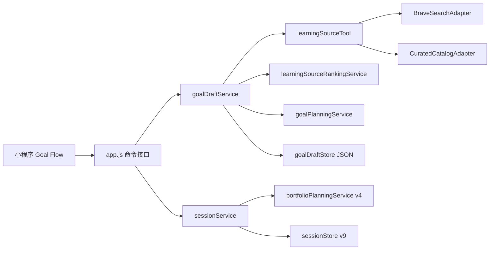

# 织梦学旅当前精修：代码修改实施规格

> 版本：1.0  
> 日期：2026-09-02  
> 面向对象：接手实施的编码模型 / 开发者  
> 上位产品稿：`docs/CURRENT_REFINEMENT_DESIGN.md`  
> 本文性质：可直接施工的技术规格；若与旧文档冲突，以本文和上位产品稿中的 R1-R5、T1 为准

## 0. 执行模型必须先理解的结论

这不是一次“增加几个页面”的开发，也不是把两个常量从 `3` 改成 `1`。本次改造要把现有流程从：

```text
输入目标 -> AI 直接生成泛化计划 -> 每个目标每天发布 3 主线 + 2 支线
```

改为：

```text
输入目标和偏好
  -> 后端搜索真实学习源
  -> LLM 只在真实候选中整理最多三套路线
  -> 用户确认来源
  -> 生成来源绑定的阶段与首周计划
  -> 用户确认计划
  -> 正式创建目标
  -> 所有目标合计每天发布 1 个核心任务 + 最多 2 个可选任务
```

必须同时满足：

1. 用户确认来源和计划之前，不得创建正式目标、今日任务、星位、奖励或初始化剧情。
2. 常规核心任务必须带 `sourceRef`；无法核实章节时允许定位到来源 URL，但不得编造页码、课时或题号。
3. 全局只有一个核心任务；可选任务不点亮主星。
4. 一句话总结完全可跳过；填写时为 5-100 个字符，跳过不影响任何奖励。
5. 保留当前专注页、角色、剧情、奖励、星图、拆小/替换/调轻能力。
6. 不引入数据库、登录体系重构、多 Agent 框架、MCP、掌握度、测验、产物上传、恢复模式或候选池。

## 1. 当前实现基线与危险耦合

### 1.1 当前技术栈

- 后端为 Node 原生 `http` 服务，入口是 `backend/server.js` 与 `backend/src/app.js`。
- 业务状态由 `backend/src/store/sessionStore.js` 的 JSON Store 保存。
- 主要编排集中在 `backend/src/services/sessionService.js`。
- LLM 统一从 `backend/src/services/deepseekService.js` 调用普通 Chat Completions；它没有网页搜索能力。
- 小程序为原生微信小程序，网络入口为 `miniprogram/services/api.js`。
- 当前 `package.json` 没有运行时依赖，Dockerfile 也没有执行 `npm install`。

### 1.2 `3+2` 不是一处常量

以下位置同时假设“每目标每天 3 个主线”：

- `sessionService.js`
  - `PORTFOLIO_MAIN_TASKS_PER_DAY`
  - `buildPortfolioGoal`
  - `ensureGoalSeriesConstellations`
  - `refreshPortfolioGoalMetrics`
  - `ensurePortfolioGoalShape`
  - `releasePortfolioGoalTasks`
  - `ensurePortfolioDailyPlan`
  - `completeTask` 的完成提示
- `portfolioPlanningService.js`
  - `PLANNING_VERSION = 3`
  - `MAIN_TASKS_PER_DAY = 3`
  - `MAIN_ROLES = LEARN/PRACTICE/VERIFY`
  - 星位 ID 公式 `(day - 1) * 3 + slot`
  - 每日预算切分、质量检查、滚动规划
- 小程序首页和目标工作台的文案与布局。
- 现有测试对 3 主线、2 支线、15 星图的断言。

因此必须通过 `meta.version = 9`、`goalPortfolio.version = 2`、`planningVersion = 4` 做显式迁移。禁止只改常量，否则旧星位、当前任务和奖励收集会错位。

### 1.3 初始化和并行目标目前都过早发布

- `createSession(payload)` 在注册时直接生成目标计划、星位、今日任务和开场。
- `createParallelGoal(payload)` 在新建目标时直接生成计划并立即释放当天任务。
- `features/account/entering` 一进入就调用 `createSession`。
- `features/adventure/goal-map` 只用标题和天数弹窗新建目标。

这些调用链都必须改成“Goal Draft -> 来源确认 -> 计划确认 -> 正式创建”。

## 2. 本轮最终架构



设计边界：

- `learningSourceTool` 负责真实世界数据，不负责选择路线。
- `learningSourceRankingService` 只能使用工具返回的 `sourceId`，不得新增来源。
- `goalPlanningService` 只围绕已选择来源生成草案。
- `goalDraftService` 管理状态机和校验，不发奖励。
- `sessionService` 只在确认命令中把草案转为正式目标。
- `portfolioPlanningService` 负责单目标规划节点；全局 1+2 的选择由 `sessionService` 负责。
- 用户仍只看到一个伴学角色；以上是后端职责，不是多个对话 Agent。

## 3. 明确的首发搜索选型

### 3.1 固定选型

首发使用 Brave Web Search 的直接 REST 适配器：

- Endpoint：`https://api.search.brave.com/res/v1/web/search`
- 鉴权头：`X-Subscription-Token`
- 请求参数：`q`、`count=10`、`safesearch=strict`、`extra_snippets=true`
- 读取字段：`web.results[].title/url/description/extra_snippets`
- API Key 只存在服务端环境变量，禁止写入小程序或日志。

官方参考：

- [Brave Search API Quickstart](https://api-dashboard.search.brave.com/documentation/quickstart)
- [Brave Web Search API Reference](https://api-dashboard.search.brave.com/api-reference/web/search/get)

当前不引入 MCP。MCP 是 Host/Client/Server 之间暴露 tools/resources/prompts 的标准协议，不是搜索结果来源；本轮固定调用链没有必要承担 MCP 会话、能力协商和授权成本。接口应允许未来新增 `McpSearchAdapter`，但不得实现或安装它。

### 3.2 环境变量

在 `backend/src/config/env.js` 增加：

```js
search: {
  provider: process.env.SEARCH_PROVIDER || "brave",
  enabled: Boolean(process.env.BRAVE_SEARCH_API_KEY),
  apiKey: process.env.BRAVE_SEARCH_API_KEY || "",
  baseUrl: process.env.BRAVE_SEARCH_API_URL || "https://api.search.brave.com/res/v1/web/search",
  timeoutMs: clampEnvInt(process.env.SEARCH_TIMEOUT_MS, 6000, 1000, 12000),
  resultCount: clampEnvInt(process.env.SEARCH_RESULT_COUNT, 10, 3, 20),
}
```

同时给 `deepseekService.chatCompletion` 增加可选 `timeoutMs` 和 `AbortController`，默认 25 秒。新来源排序调用使用 10 秒；计划调用使用 20 秒。超时必须返回可降级错误，不能无限挂起。

### 3.3 无搜索配置时的行为

顺序固定为：

1. `BRAVE_SEARCH_API_KEY` 存在：Brave 候选 + 人工目录候选合并去重。
2. Key 不存在或 Brave 超时/限流：仅使用人工目录。
3. 人工目录也没有匹配：返回 `NO_RELIABLE_SOURCE`，前端引导用户输入已有资料。
4. 禁止让 LLM 凭记忆补出链接。

## 4. 新增文件

### 4.1 后端

```text
backend/src/lib/errors.js
backend/src/store/goalDraftStore.js
backend/src/services/goalDraftService.js
backend/src/services/learningSourceTool.js
backend/src/services/learningSourceSearchService.js
backend/src/services/learningSourceRankingService.js
backend/src/services/adapters/braveSearchAdapter.js
backend/src/services/adapters/curatedCatalogAdapter.js
backend/src/services/sourceUrlSafetyService.js
backend/config/learning-sources/catalog.json
backend/tests/goal-draft-flow.test.js
backend/tests/learning-source-search.test.js
backend/tests/daily-portfolio-v4.test.js
backend/tests/session-v9-migration.test.js
backend/tests/task-summary.test.js
```

本轮不增加 HTML 全文抓取依赖。首发来源结构只来自：

- 人工目录中已核验的 `structure`；
- 用户明确输入的章节/课程结构；
- 搜索结果中可验证的标题和 URL。

对于普通搜索结果，`extractPublicOutline` 可以返回空结构和 `outlineStatus: "UNVERIFIED"`。计划只能用 `locatorType: "URL"`，不能猜章节。后续若要做通用网页目录抽取，应作为独立迭代评估 SSRF、版权、HTML 解析和平台登录，不在本轮偷加一个正则抓取器。

### 4.2 小程序

```text
miniprogram/features/goal/setup/index.{js,json,wxml,wxss}
miniprogram/features/goal/source-select/index.{js,json,wxml,wxss}
miniprogram/features/goal/plan-review/index.{js,json,wxml,wxss}
```

`app.json` 增加：

```json
{
  "root": "features/goal",
  "pages": ["setup/index", "source-select/index", "plan-review/index"]
}
```

## 5. Goal Draft 数据模型与状态机

### 5.1 为什么单独使用 `goalDraftStore`

草稿可能在用户正式注册前产生，不能放进已登录账号快照；`createSession` 又会调用 `resetSessionState`。因此增加独立 JSON 文件 `runtime/goal-drafts.json`，仍属于当前 JSON Store 技术路线，不引入数据库。

草稿禁止保存：

- 登录密码；
- DeepSeek Key；
- Brave Search Key；
- 任何用户账号凭据。

初次注册所需账号和密码只保存在小程序 `globalData.registrationPayload` 内存中，并在最终确认请求时发送；不得写入 `wx.setStorage`。

### 5.2 草稿结构

```ts
type GoalDraftStatus =
  | "CREATED"
  | "SOURCES_READY"
  | "SOURCE_SELECTED"
  | "PLAN_READY"
  | "CONFIRMED"
  | "EXPIRED";

interface GoalDraft {
  draftId: string;                 // crypto.randomUUID()
  revision: number;                // 每次成功修改 +1
  mode: "INITIAL" | "PARALLEL";
  status: GoalDraftStatus;
  goalProfile: {
    roleId?: string;               // INITIAL 有值
    name?: string;                 // INITIAL 有值
    title: string;
    deadline: string;
    durationDays: number;
    dailyTime: string;
    dailyBudgetMinutes: number;
    currentLevel: "BEGINNER" | "UNSYSTEMATIC" | "SPRINT";
    sourcePreference: "VIDEO" | "TEXT" | "PRACTICE" | "ANY";
    accessPreference: "FREE_ONLY" | "PAID_OK" | "OWNED";
  };
  userProvidedSources: LearningSource[];
  sourceCandidates: LearningSource[];
  sourceBundles: SourceBundle[];
  selectedBundleId: string | null;
  planDraft: SourceBoundPlan | null;
  lastAdjustment: string;
  createdAt: string;
  updatedAt: string;
  expiresAt: string;               // 创建后 24 小时
  confirmedAt: string | null;
  confirmationKey: string | null;  // 网络重试幂等
  confirmedGoalId: string | null;
}
```

### 5.3 状态迁移

```text
CREATED
  -> SOURCES_READY          执行来源搜索成功，至少一套可选路线
  -> SOURCE_SELECTED        用户选择路线或录入已有来源
  -> PLAN_READY             来源绑定计划通过校验
  -> CONFIRMED              正式目标创建成功
```

规则：

- 选择另一套来源：`PLAN_READY -> SOURCE_SELECTED`，清空旧 `planDraft`。
- 修改目标/偏好：回到 `CREATED`，清空候选、选择和计划。
- 调整计划：保持所选来源，重新生成后回到 `PLAN_READY`。
- 任何修改都要求请求携带 `expectedRevision`；不相等返回 HTTP 409、错误码 `DRAFT_REVISION_CONFLICT`。
- 已确认草稿不允许再修改；相同 `confirmationKey` 重试返回已创建目标，不重复注册、发任务或发奖励。
- 每次读取/写入清理过期草稿；最多保留 100 条，已确认草稿保留 24 小时用于幂等后删除。

### 5.4 `goalDraftStore.js` 必须暴露

```js
createGoalDraft(input)
getGoalDraft(draftId)
updateGoalDraft(draftId, expectedRevision, mutator)
markGoalDraftConfirmed(draftId, expectedRevision, receipt)
findConfirmationReceipt(draftId, confirmationKey)
pruneGoalDrafts(now)
```

写文件沿用项目现有同步 JSON Store 风格，采用“写临时文件后 rename”的原子替换，避免进程中断留下半截 JSON。不要把草稿混进账号快照。

## 6. 学习源模型

```ts
interface LearningSource {
  sourceId: string;
  origin: "BRAVE" | "CURATED" | "USER";
  title: string;
  provider: string;
  type: "SYLLABUS" | "BOOK" | "COURSE" | "DOCS" | "QUESTION_BANK" | "PROJECT" | "DATASET" | "OTHER";
  url: string;
  accessType: "FREE" | "PAID" | "LOGIN_REQUIRED" | "OWNED" | "UNKNOWN";
  editionOrVersion: string;
  language: string;
  description: string;
  structure: Array<{
    locatorType: "CHAPTER" | "LESSON" | "SECTION" | "EXERCISE_SET";
    locatorLabel: string;
    locatorUrl: string;
    order: number;
  }>;
  outlineStatus: "VERIFIED" | "USER_PROVIDED" | "UNVERIFIED";
  verificationStatus: "VERIFIED" | "PARTIAL" | "UNAVAILABLE";
  verifiedAt: string;
  caution: string;
}

interface SourceBundle {
  bundleId: string;
  label: string;                   // 系统路线/高效路线/实践路线或模型生成的简短名称
  sourceIds: string[];
  sourceRoles: Array<{ sourceId: string; role: string }>;
  fitReason: string;
  caution: string;
  estimatedScope: string;
  recommended: boolean;
}

interface SourceRef {
  sourceId: string;
  sourceTitle: string;             // 历史快照，不依赖以后改名
  locatorType: "CHAPTER" | "LESSON" | "SECTION" | "EXERCISE_SET" | "URL";
  locatorLabel: string;
  locatorUrl: string;
  verified: boolean;
}
```

硬校验：

- `sourceId` 必须来自当前草稿 `sourceCandidates` 或 `userProvidedSources`。
- URL 只允许 `http:` / `https:`，禁止用户名密码、localhost、`.local`、环回、链路本地和私有网段。
- 搜索候选的 URL 归一化时移除 `utm_*`、`ref` 等跟踪参数，使用规范化 URL 去重。
- `verifiedAt` 为后端时间，不采信 LLM 输出。
- `accessType`、版本、价格无法核实时一律 `UNKNOWN`/空字符串，不猜。
- 用户输入教材名但无 URL 时，允许 `url: ""`、`origin: "USER"`，必须标记 `verificationStatus: "PARTIAL"`；计划不得生成虚假链接。

## 7. 搜索、排序与降级的实现要求

### 7.1 `braveSearchAdapter.js`

导出：

```js
async function search(query, options = {})
```

返回统一数组，不把 Brave 原始响应泄漏到业务层。要求：

- `AbortController` 超时；
- 非 2xx 转换为 `SEARCH_PROVIDER_ERROR`，日志只记录状态码，不记录 Key；
- 最多取 10 条；
- 对 `title/url/description/extra_snippets` 做长度限制；
- 只返回 URL 通过安全校验的结果；
- `sourceId` 使用规范化 URL 的稳定 SHA-256 前 16 位，例如 `src-brave-ab12...`。

### 7.2 `curatedCatalogAdapter.js`

读取 `backend/config/learning-sources/catalog.json`。目录条目必须人工核验，并带：

```json
{
  "catalogVersion": 1,
  "sources": [
    {
      "sourceId": "curated-example",
      "title": "...",
      "provider": "...",
      "type": "DOCS",
      "url": "https://...",
      "languages": ["zh-CN"],
      "topics": ["..."],
      "accessType": "FREE",
      "editionOrVersion": "",
      "structure": [],
      "verifiedAt": "2026-09-02T00:00:00.000Z"
    }
  ]
}
```

目录不是为了堆数量。首个提交只放经过实际打开验证的官方文档、大纲、公开课程和题库；如果没有可靠条目，可以保持少量，不得为测试编造来源。

### 7.3 `learningSourceSearchService.js`

职责：

1. 根据目标、基础、媒介与费用偏好构造 2-4 个检索词；
2. 调用 `learningSourceTool.searchSources`；
3. 合并人工目录；
4. 规范化、去重和基础校验；
5. 对最多 12 个候选执行轻量 URL 可访问性校验；
6. 把可访问候选交给排序层；
7. 排序层失败时使用确定性降级组合。

检索词可由规则生成，不需要额外 LLM 调用。例如：

```text
"{目标}" 官方 课程 大纲
"{目标}" 官方 文档 教程
"{目标}" 练习 真题 题库
```

来源偏好只影响追加关键词和排序，不做绝对过滤；`FREE_ONLY` 则必须过滤已知 `PAID`，未知价格可保留但明确标注未核实。

轻量 URL 校验只确认“当前链接可连接”，不读取或保存正文：

- 先通过 `sourceUrlSafetyService` 检查协议、主机名和 DNS 解析结果；
- 优先发 `HEAD`；对明确不支持 HEAD 的 405/501 使用 `GET` + `Range: bytes=0-0`；
- `redirect: "manual"`，最多跟随 3 次，每次都重新校验 Location 和 DNS；
- 单 URL 超时 2500ms，并发最多 3；
- 2xx 记为可访问；401/403 记为 `LOGIN_REQUIRED`/`PARTIAL`；404、410 和网络失败记为 `UNAVAILABLE`；
- 不依据返回 HTML 猜价格、版本或目录；不把响应 body 交给 LLM。

### 7.4 `learningSourceRankingService.js`

输入是候选的精简 JSON，输出最多三套路线。Prompt 中必须写明：

- 只能引用给定 `sourceId`；
- 可以使用一个或多个来源，数量由目标决定；
- 优先少而稳定，但不是硬性一主一辅；
- 每个来源说明角色；
- 不输出分数；
- 不补全价格、版本、目录或新 URL；
- 如果只有一套可靠路线就返回一套。

LLM 返回后必须执行 `validateSourceBundles`：

- `1 <= bundles.length <= 3`；
- 所有 `sourceIds` 在候选集合中；
- 同一 bundle 不重复；
- 每个 bundle 都有 `fitReason`、`caution`；
- 最多一个 `recommended=true`，没有时把第一项设为推荐；
- 无效 bundle 丢弃，而不是让 LLM 重试无限次。

若全部无效，确定性降级：按 `CURATED > USER > BRAVE`、官方域名、偏好匹配排序，选择最高质量的 1-3 个来源组成一套“可靠基础路线”。降级文案必须说明“由已核验来源自动组合”。

## 8. 来源绑定计划

### 8.1 计划结构

```ts
interface SourceBoundPlan {
  version: 1;
  goalTitle: string;
  stageGoals: Array<{
    stageId: string;
    title: string;
    description: string;
    startDay: number;
    endDay: number;
    sourceIds: string[];
  }>;
  firstWeek: Array<{
    day: number;                    // 1-7，不要求每个日历日都有任务
    coreTask: {
      title: string;
      detail: string;
      estimatedMinutes: number;
      sourceRef: SourceRef;
      selectionReason: string;
    };
    optionalTasks: Array<{
      title: string;
      detail: string;
      estimatedMinutes: number;
      sourceRef: SourceRef | null;
      selectionReason: string;
    }>;
  }>;
  weeklyMilestones: Array<{
    week: number;
    title: string;
    outcome: string;
  }>;
  totalEstimatedMinutesFirstWeek: number;
  generatedAt: string;
  source: "llm" | "fallback";
}
```

### 8.2 `goalPlanningService.js` 修改

新增并导出：

```js
generateSourceBoundPlan(input, options)
validateSourceBoundPlan(plan, context)
repairSourceBoundPlan(plan, context)
generateSourceBoundPlanFallback(context)
```

保留旧 `generateGoalPlan` / `generateRollingTaskPlan` 供旧代码迁移期间使用，但新 Goal Draft 流程禁止调用它们。

新计划 Prompt 仅包含：

- 目标、期限、每日时间、基础；
- 用户确认的来源及可验证结构；
- 用户本次调整意见；
- 最近完成摘要（并行目标调整时才有，最多 5 条）。

禁止把 Brave 原始网页内容、账号信息、密码、API Key 送入 Prompt。

### 8.3 计划校验器

`validateSourceBoundPlan` 必须确定性检查：

- 阶段数 2-6；
- 第一周最多 7 个核心任务，每日最多 1 个；
- 每日可选任务最多 2 个；
- 核心时长 5-90 分钟且原则上不超过每日预算 70%；
- 当天核心 + 可选总时长不超过每日预算；
- 常规核心任务必须有 `sourceRef`；
- `sourceRef.sourceId` 在用户确认 bundle 内；
- 精确 locator 必须存在于该来源 `structure`；
- 没有结构时强制降级为 `locatorType: "URL"`、`locatorLabel: source.title`、`verified: false`；
- 标题包含动作、范围和来源位置，禁止“学习一下”“推进目标”等空标题；
- 相邻任务不能有相同规范化标题；
- 不加入未确认来源。

修复顺序：

1. 规则修复数量、时长、locator 和重复项；
2. 仍不通过时允许 LLM 重写一次；
3. 仍失败则使用 fallback 计划并在草稿中记录 `planWarnings`；
4. 绝不静默确认和发布。

## 9. API 契约

### 9.1 路由

在 `apiRoutes.js` 增加：

```text
POST /api/goal-drafts
GET  /api/goal-drafts/{draftId}
POST /api/goal-drafts/{draftId}/source-searches
POST /api/goal-drafts/{draftId}/source-selections
POST /api/goal-drafts/{draftId}/plan-generations
POST /api/goal-drafts/{draftId}/confirmations
POST /api/goals/{goalId}/priority
```

项目 CORS 的允许方法同步加入 `GET,POST,OPTIONS`（GET 已有，不需要 PATCH）。新增 matcher 时先匹配具体 Goal Draft 路由，再匹配通用 `/api/goals`。

### 9.2 创建草稿

请求：

```json
{
  "mode": "INITIAL",
  "goalProfile": {
    "roleId": "traveler",
    "name": "林岚",
    "title": "30 天完成 CET-6 阅读专项",
    "deadline": "30 天后",
    "durationDays": 30,
    "dailyTime": "1 小时",
    "currentLevel": "UNSYSTEMATIC",
    "sourcePreference": "TEXT",
    "accessPreference": "FREE_ONLY"
  }
}
```

响应只返回公开 DTO，不返回内部错误栈或任何凭据：

```json
{
  "draftId": "...",
  "revision": 1,
  "status": "CREATED",
  "goalProfile": { "...": "..." }
}
```

### 9.3 搜索来源

请求：

```json
{
  "expectedRevision": 1,
  "userSources": [
    {
      "title": "我已有的教材",
      "url": "https://example.com",
      "editionOrVersion": "第 3 版"
    }
  ]
}
```

`userSources` 可为空。响应：更新后的 `revision/status/sourceBundles`，并返回 `searchMode: "BRAVE_AND_CATALOG" | "CATALOG_ONLY" | "USER_ONLY"` 和非敏感 `warnings`。

### 9.4 选择来源

```json
{
  "expectedRevision": 2,
  "bundleId": "bundle-..."
}
```

只能选当前草稿中的 bundle。选择后 `status=SOURCE_SELECTED`，旧计划清空。

### 9.5 生成/调整计划

```json
{
  "expectedRevision": 3,
  "adjustment": "周三只有 30 分钟，请把较长任务移到周末。"
}
```

第一次可以省略 `adjustment`；非空时 5-200 字。响应包含 `planDraft`、`planWarnings` 和新 revision。

### 9.6 确认

初次注册：

```json
{
  "expectedRevision": 4,
  "confirmationKey": "客户端本次确认生成的 UUID",
  "registration": {
    "account": "user@example.com",
    "password": "只在本请求发送",
    "apiKey": "可选，沿用当前功能"
  }
}
```

并行目标不传 `registration`。服务端根据草稿 `mode` 分支：

- `INITIAL`：调用新的 `createSessionFromConfirmedDraft(draft, registration)`；
- `PARALLEL`：调用新的 `createParallelGoalFromConfirmedDraft(draft)`。

事务顺序：

1. 校验 revision、状态、来源和计划；
2. 检查 confirmation receipt；
3. 完成正式状态写入并 `saveStore()`；
4. 标记 draft confirmed 并写 receipt；
5. 返回 command result。

若第 4 步失败，重试时需通过正式状态中的 `originDraftId` 找到已创建目标并补写 receipt，禁止重复创建。

### 9.7 任务完成

保持路径：

```text
POST /api/tasks/{taskId}/completion
```

请求：

```json
{ "summary": "我理解了二分查找循环边界为什么容易写错。" }
```

也允许 `{}` 或 `{ "summary": "" }`。后端规则：

- trim 后空串视为未填写；
- 非空必须 5-100 个 Unicode 字符；
- `completeTask(taskId, payload = {})`；
- `app.js` completion handler 必须先 `parseBody(req)`；
- summary 校验要在 `task.done = true` 之前完成；
- 重复完成仍按现有逻辑报错，不重复奖励。

### 9.8 错误格式

新增 `AppError`：

```js
new AppError(code, message, statusCode, details)
```

`buildErrorResponse` 增加 `code`，`app.js` catch 使用 `error.statusCode || 400`。至少定义：

```text
DRAFT_NOT_FOUND
DRAFT_EXPIRED
DRAFT_REVISION_CONFLICT
INVALID_DRAFT_STATE
NO_RELIABLE_SOURCE
SOURCE_PROVIDER_UNAVAILABLE
SOURCE_BUNDLE_INVALID
PLAN_VALIDATION_FAILED
SUMMARY_TOO_SHORT
SUMMARY_TOO_LONG
DAILY_OPTIONAL_LIMIT_REACHED
```

小程序 `normalizeError` 保留 `body.code`，页面据此展示状态，不解析中文 message 来判断业务分支。

## 10. 正式 Goal、Node、Task 字段

### 10.1 Goal

`goalPortfolio.goals[]` 增加：

```ts
originDraftId: string;
sourcePreferences: {
  currentLevel: string;
  sourcePreference: string;
  accessPreference: string;
};
learningSources: LearningSource[];          // 确认时快照
selectedSourceBundleId: string;
planStatus: "CONFIRMED";
planConfirmedAt: string;
priority: "PRIMARY" | "SECONDARY" | "INACTIVE";
planningVersion: 4;
starsPerDay: 1;
```

来源只写 `goalPortfolio`，不要再给 legacy `goalPlan` 加第二份来源状态。

### 10.2 Node

```ts
sourceRef: SourceRef;
priorityTier: "CORE";
selectionReason: string;
legacyNode: boolean;
```

新节点 ID 不再依赖 `day * 3 + slot`，使用：

```text
{goalId}-core-{day}-{shortId}
```

ID 一旦生成禁止重新 canonicalize。

### 10.3 Task

```ts
sourceRef: SourceRef | null;
priorityTier: "CORE" | "OPTIONAL";
selectionReason: string;
completionSummary: string;
originDraftId: string;
```

`task.type` 暂时保留 `main/side` 兼容剧情与奖励：

- `CORE -> type: "main"`；
- `OPTIONAL -> type: "side"`。

真正决定点星的是 `priorityTier === "CORE" && portfolioNodeId`，不能只看 `type`。

### 10.4 DTO

`apiContract.js`：

- `buildTaskDto` 增加 `sourceRef/priorityTier/selectionReason/completionSummary`。
- `buildGoalPortfolioDto` 增加来源偏好、学习源、bundle、planStatus、priority、planConfirmedAt。
- node DTO 增加 `sourceRef/priorityTier/selectionReason/legacyNode`。
- `starsPerDay` 默认值从 3 改 1，但旧数据有显式值时按迁移结果。
- 新增 `buildLearningSourceDto/buildSourceBundleDto/buildGoalDraftDto/buildSourceBoundPlanDto`。
- DTO 必须重新构造对象，禁止直接把草稿 store 或 provider 原始响应透传给前端。

## 11. `portfolioPlanningService.js` v4 修改

### 11.1 常量

```js
const PLANNING_VERSION = 4;
const CORE_TASKS_PER_DAY = 1;
const OPTIONAL_TASKS_PER_DAY = 2;
```

删除 `MAIN_ROLES` 的“三角色必须覆盖”约束。角色能力是后台职责，不是每天必须各发一项任务。

### 11.2 函数调整

- `allocateMinutes`：核心预算最多为总预算 70%，可选任务分享剩余预算；没有可选任务时不为凑满而生成。
- `createConcreteDomainTasks` 改为 `createCoreTask`，优先读取 `planningBlueprint.firstWeek[day].coreTask`。
- `createDayTaskSet` 返回单个核心任务数组或直接返回对象；为减少调用方改动，建议仍返回长度 1 数组。
- `validateDayTaskSet`：检查数量为 1、动作具体、时长、phase、`sourceRef`，删除 `ROLE_COVERAGE`。
- `planRollingHorizon`：每个未来日只创建一个 node；不再补 slot 2/3；不得改写已有 DONE/AVAILABLE 节点 ID。
- `buildSideTasks` 改名 `buildOptionalTasks`，优先读取确认计划的 optionalTasks；fallback 最多生成 1 个同来源整理任务，不必凑满 2 个。
- `initializeGoalPlanning` 从 `SourceBoundPlan` 建立 phases、weeklyMilestones、firstWeek。
- `applyRollingTaskPlan` 只服务 legacy 路径；新流程新增 `applySourceBoundPlan` 或直接初始化 v4。

## 12. 全局 1 核心 + 最多 2 可选调度

### 12.1 目标优先级不变量

- 最多一个 `PRIMARY`；
- 最多一个 `SECONDARY`；
- 其余 `INACTIVE`；
- 新建第一个目标自动 PRIMARY；第二个自动 SECONDARY；第三个起自动 INACTIVE；
- 设置新 PRIMARY 时：旧 PRIMARY 降为 SECONDARY；若已有 SECONDARY，则原 SECONDARY 降为 INACTIVE；
- INACTIVE 不自动发布，但历史和计划保留。

`POST /api/goals/{goalId}/priority` 完成上述原子调整，然后强制重建“未来尚未开始”的今日可选项；已经完成的任务不改写，正在进行的核心任务不替换。

### 12.2 替换 `releasePortfolioGoalTasks`

不要继续按 goal 循环释放。改为两个层次：

```js
releaseCoreTaskForGoal(state, primaryGoal, planDate, dailyPlanId)
buildOptionalCandidates(state, primaryGoal, secondaryGoal, planDate)
scheduleGlobalDailyTasks(state, planDate, dailyPlanId)
```

`scheduleGlobalDailyTasks` 算法固定：

1. 找到当天已有、未完成的 CORE；有则原样续用，不发新核心。
2. 没有 CORE 且当天从未释放过核心时，从 PRIMARY 的第一个 LOCKED v4 node 释放一个。
3. 当天核心完成后也不再释放第二个；`dailyPlan.coreReleased=true` 是硬门禁。
4. 可选候选顺序：
   - 用户当天手动创建的 CUSTOM；
   - PRIMARY 同一来源的必要练习/整理；
   - SECONDARY 的下一项轻量行动。
5. 去重后按剩余时间取最多 2 个；不够就少发，不生成凑数任务。
6. INACTIVE 目标不参与。
7. 总预计时长不得超过 `dailyPlan.capacityMinutes`。

### 12.3 跨日行为

- 昨日未完成 CORE：携带到今日，保留 `sourceRef`、nodeId 和来源历史；今日不再发新 CORE。
- 昨日自动 OPTIONAL：不累计，归档到 `taskHistory`，`archivedReason="OPTIONAL_EXPIRED"`，不产生惩罚。
- 昨日 CUSTOM：可优先携带，但总可选仍不超过 2；多余项归档为 `CUSTOM_NOT_SCHEDULED`。本轮没有候选池，前端也不宣称这些是失败任务。
- 已完成任务仍按当前 rollover 归档。
- `state.tasks` 始终只包含当前日需要展示的任务以及当日已完成任务；不能把隐藏的十几个 pending 留在数组中。

### 12.4 手动自定义任务

`createTask` 创建 `priorityTier="OPTIONAL"`、`source="CUSTOM"`。若当日已有 2 个可选：

1. 先替换一个尚未完成的自动 OPTIONAL，并把被替换项归档为 `OPTIONAL_REPLACED_BY_CUSTOM`；
2. 两个可选都是 CUSTOM 时拒绝，错误码 `DAILY_OPTIONAL_LIMIT_REACHED`；
3. 不增加第四张卡，也不静默隐藏。

### 12.5 `ensurePortfolioDailyPlan`

必须移除当前“for 每个 active goal -> release 3+2”的两段循环，统一调用一次 `scheduleGlobalDailyTasks`。

DailyPlan 增加：

```ts
coreReleased: boolean;
coreTaskId: string | null;
optionalTaskIds: string[];
```

`updateDailyPlanMetrics` 同时维护这三个字段与 taskIds。

## 13. 星图与 v9 迁移

### 13.1 新账号/新目标

- 一个 v4 node 对应一个核心行动和一颗星。
- `starsPerDay=1`。
- 目标先只创建首周 7 个节点；滚动窗口不足 7 天时再补，不再一次性预建 `durationDays * 3`。
- `plannedThroughDay` 记录已经生成节点的最远 day；每天完成/打开目标时先补足后续滚动窗口。
- `totalStarCount=durationDays` 表示整个目标预计需要的核心行动数，不等于当前已物化 node 数量；页面进度使用 `completedStars/totalStarCount`。
- 目标完成必须同时满足 `plannedThroughDay >= durationDays`、已物化 node 数量等于 `durationDays`、所有 node 都为 DONE。禁止因为首周 7 个 node 已完成而提前结束 30 天目标。
- 每张星图按稳定 node 序列每 15 个分组并惰性扩展。普通 map 只有达到 15 个 node 且全部 DONE 才能结算；最后一张不足 15 个 node 的 map 只有在 `plannedThroughDay >= durationDays` 且目标其余 node 全部 DONE 时才能结算。
- `ensureGoalSeriesConstellations` 可以先创建当前涉及的 map，但不得把一个尚会继续扩展的 7 星 map 标记为完成或发放道具。

### 13.2 旧账号迁移目标

新增 `migratePortfolioPlanningV4(state)`，在 `migrateLegacyState` 内、`ensurePortfolioGoalShape` 之前执行。算法必须按以下顺序：

1. 若 goal `planningVersion >= 4`，跳过，保证幂等。
2. 按旧 constellations 的 `nodeIds` 顺序收集节点；没有 map 时按 day/slot 排序。
3. 保留所有 `status="DONE"` 的节点、nodeId、title、completedAt，并标记 `legacyNode=true`。
4. 从当前 pending 主线中只保留最早的一项作为 CORE，保留其 nodeId；如果没有对应节点，为它创建唯一 v4 node。
5. 其余未完成旧主线移除 `portfolioNodeId`、改为 OPTIONAL 候选；最多保留 2 个，其余归档为 `PLANNING_V4_RESHAPE`。
6. 找出旧数据中最后一个已经触达的 day；从其后到 `durationDays` 每天创建一个 v4 core node。若当前触达日有保留 core，不重复创建。
7. 新 node ID 使用随机/稳定短 ID，不复用旧 `goal-star-N` 公式。
8. `goal.nodes = preservedDone + preservedCurrentCore + futureV4Nodes`。
9. 用该顺序重新按 15 个分组：
   - 优先复用同序号旧 map 的 `mapId/constellationId/name`；
   - 已经存在于 `state.starMap.collections` 的 mapId 和前 15 个完成节点绝不改动；
   - 未完成 map 可以用保留 DONE 前缀 + 新 v4 节点重新填充；
   - 禁止因迁移再次发放星图道具。
10. `completedStars` 按 DONE 节点计；迁移目标的 `totalStarCount=goal.nodes.length`，因为其中包含全部保留历史星和剩余日的新节点；`plannedThroughDay=durationDays`；`starsPerDay=1`；`planningVersion=4`。
11. `completedDays` 只作为兼容展示字段，不再决定目标完成。迁移目标完成条件为 `plannedThroughDay >= durationDays` 且所有保留/新 node 均 DONE。
12. 写入 `goal.migratedToPlanningV4At`。

迁移前后必须断言：

- 旧 DONE node 数量不减少；
- 旧 DONE nodeId、completedAt 不变化；
- `state.starMap.collections` 数量不因单纯迁移增加；
- 任何 pending task 最多一个 CORE；
- 全局当前 tasks 最多 1 CORE + 2 OPTIONAL；
- 重复运行迁移后 JSON 语义不变化。

### 13.3 修改现有星图函数

- `ensureGoalSeriesConstellations` 不再自己按 `goalId-star-N` 推导 nodeIds，只按 `goal.nodes` 的稳定顺序分组。
- `refreshPortfolioGoalMetrics` 不再重置 `totalStarCount=durationDays*3`，并按“新目标滚动目标数”与“迁移目标保留星总数”分别处理。
- `ensurePortfolioGoalShape` 不再过滤 slot 2/3、不再 canonicalize nodeId。
- `collectCompletedPortfolioConstellations` 沿用 `seriesMapId` 幂等判断；迁移测试必须证明不会重复奖励。
- 星星详情增加 `sourceTitle` 和可选 `completionSummary` 快照。

## 14. 初始化与并行目标调用链

### 14.1 初次注册

修改后的完整链路：

```text
role-select
  -> account/register（账号、目标、基础、来源偏好）
  -> goal/source-select（创建 INITIAL draft + 搜索 + 选择）
  -> goal/plan-review（生成/调整计划）
  -> account/entering（调用 confirmations）
  -> account/init-result
  -> home
```

`createSessionFromConfirmedDraft`：

1. 验证账号可用；
2. 把 draft 和 registration 深拷贝到局部变量；
3. `resetSessionState`；
4. 初始化角色、profile 和 agent；
5. 不再调用旧 `buildGoalPlanForState` 生成另一份计划；
6. 将确认 `SourceBoundPlan` 转成兼容 `goalPlan` 的最小阶段数据，仅供旧剧情/副本读取；
7. 用 `buildPortfolioGoal` v4 建正式 goal，写入来源和 `originDraftId`；
8. 设置 PRIMARY；
9. 生成简短 opening blueprint；
10. 创建当天 DailyPlan 并只释放 1 CORE + 最多 2 OPTIONAL；
11. 注册账号、保存快照。

账号注册必须仍位于所有 LLM/计划异步步骤成功之后，避免 ghost account；但计划已在草稿阶段完成，确认阶段只允许 opening narrative 失败后使用模板，不应让来源和计划失效。

### 14.2 并行目标

`goal-map` 的“新增长期目标”不再调用 `api.createGoal(title, days)`，改为跳转：

```text
/features/goal/setup/index?mode=PARALLEL
```

最终调用 `createParallelGoalFromConfirmedDraft`：

- 禁止再次调用 `generateGoalPlan` / `generateRollingTaskPlan`；
- 直接从 draft 建 goal；
- 按 PRIMARY/SECONDARY/INACTIVE 空位设置 priority；
- 如果今日已有 CORE，不因新目标立即再发 CORE；
- 最多在剩余预算和可选空位允许时加入一项新 SECONDARY optional；
- 已完成和正在执行的当前任务不改写。

保留旧 `POST /api/goals` 一段兼容期，但改为返回 HTTP 410、错误码 `GOAL_DRAFT_REQUIRED`，小程序新代码不得调用。不要保留一个绕过来源确认的暗门。

## 15. 一句话总结的落点

`completeTask(taskId, payload)` 开头：

```js
const completionSummary = normalizeOptionalSummary(payload.summary);
```

完成后：

- `task.completionSummary = completionSummary`；
- 有总结时，Diary body 追加 `\n\n今日总结：...`；
- 有总结时，Memory `memorySummary` 在故事摘要后追加用户原文，但总长度限制在既有 memory 允许范围；
- `recordTaskMemory` 记录最终 memorySummary；
- `generateTaskNarrative` 的 input 增加可选 `userSummary`，但仅用于叙事延续，不得输出正确率或掌握度；
- 星图 collection 在收集节点时把 `sourceTitle/completionSummary` 写入 stars 快照；
- 无总结时保持旧 narrative、reward、skill、星图流程完全一致。

完成提示改为：

```text
CORE：一颗主星已点亮，今天的核心行动已完成。
OPTIONAL：可选行动已完成，不计入主星进度。
```

删除“今日共有 3 颗可完成”和“今日五任务组”文案。

## 16. 小程序具体修改

### 16.1 `app.js`

`globalData` 增加：

```js
goalFlow: null
```

约定结构：

```js
{
  mode,
  draftId,
  revision,
  goalProfile,
  sourceBundles,
  selectedBundleId,
  planDraft,
  confirmationKey
}
```

`registrationPayload` 只保留账号、密码、可选 apiKey；不得持久化。

### 16.2 `services/api.js`

新增：

```js
createGoalDraft(payload)
getGoalDraft(draftId)
searchGoalDraftSources(draftId, payload)
selectGoalDraftSources(draftId, payload)
generateGoalDraftPlan(draftId, payload)
confirmGoalDraft(draftId, payload)
updateGoalPriority(goalId, priority)
completeTask(taskId, summary) // body { summary }
```

所有 path segment 使用 `encodeURIComponent`。`unwrap` 抛出的 Error 附带 `code/details/statusCode`。

### 16.3 `features/account/register`

保留账号、密码、昵称、目标、截止、每日时间，增加三个 picker：

- 当前基础：零基础 / 学过但不系统 / 正在冲刺；
- 来源偏好：视频 / 文字 / 题目实践 / 不限；
- 使用限制：仅免费 / 可付费 / 已有资料。

提交后：

- credentials -> `registrationPayload`；
- 非敏感目标字段 -> `goalFlow.goalProfile`；
- 导航到 source-select；
- 不调用 `createSession`，不进入 entering。

### 16.4 `features/goal/setup`

仅用于 PARALLEL，复用注册页的目标、截止、每日时间和三个偏好控件，不显示账号密码。提交后进入 source-select。

不要为了复用把两个页面重构成复杂组件；可抽取 `utils/goal-flow.js` 保存枚举映射和校验。

### 16.5 `features/goal/source-select`

页面状态：

```text
CREATING_DRAFT
SEARCHING
READY
EMPTY
ERROR
SELECTING
```

交互：

- onLoad 无 draft 时先 create，再 search；已有 draft 时 GET 恢复；
- 推荐 bundle 展开，其他 bundle 紧凑折叠；
- 点击来源使用 `wx.navigateTo`/`web-view` 的现有可行方式，不能把未知 URL 当小程序内部路径；
- “我已有资料”输入标题、链接（可空）、版本；提交后重新 search；
- 不可用来源禁用选择；
- 选择成功更新 revision 后进入 plan-review；
- 返回修改偏好时清理候选并重建 draft，不能把旧 bundle 配给新目标。

### 16.6 `features/goal/plan-review`

显示：

- 已选择来源；
- 阶段目标；
- 第一周每天唯一核心任务、来源位置、预计时间；
- 可选任务用低权重展开，不与核心等高；
- adjustment 文本输入；
- “重新生成”与唯一主按钮“确认并开始”。

INITIAL 点击确认：保存 confirmationKey，导航 entering，由 entering 调确认接口。  
PARALLEL 点击确认：本页调用确认接口，成功后清空 goalFlow，返回目标工作台。

### 16.7 `features/account/entering`

- 不再调用 `api.createSession(registrationPayload)`；
- 改调 `api.confirmGoalDraft(draftId, { expectedRevision, confirmationKey, registration })`；
- confirmationKey 在首次进入时生成，重试复用；
- 成功后立刻把 `registrationPayload=null`、`goalFlow=null`；
- 失败时保留内存数据供重试，但页面不得打印密码/API Key；
- 加载文案改成“正在创建已确认的学习路线”，不再假装此时才搜索和规划。

### 16.8 `pages/home`

数据派生：

```js
const coreTask = tasks.find(t => t.priorityTier === "CORE");
const optionalTasks = tasks.filter(t => t.priorityTier === "OPTIONAL").slice(0, 2);
```

布局：

- “Todo”改“今天”；
- CORE 唯一大卡，显示目标、来源位置、预计时间、selectionReason、开始按钮；
- OPTIONAL 为紧凑行，标题“有余力再做”；
- 卡片不展示成长/资源预告；
- 快捷菜单只留“新建目标”“自定义任务”；
- “目标工作台”“调整今天”改为普通文字入口；
- 删除固定 3+2 文案；
- 无 CONFIRMED 计划时显示明确空状态，不自动生成泛化任务。

### 16.9 `features/adventure/goal-map`

- 删除两字段新目标 modal 和 `api.createGoal` 调用；
- 首屏显示 priority、已确认来源、当前阶段、星图一个核心指标；
- 删除 planningQuality 分数；
- 增加主/次目标切换控件，调用 priority API；
- 七日区只展示已确认的核心任务顺序；
- 今日任务不重复完整卡片，只提供“返回今天”。

### 16.10 `features/adventure/focus`

不修改计时、暂停、休息、结束逻辑。只确保带着完整 task DTO 跳转 completion。

### 16.11 `features/adventure/completion`

删除 onLoad 自动结算和模拟四阶段进度。改为两段状态：

1. `INPUT`：可选 textarea，maxlength=100，显示字数；按钮“完成并结算”；低权重文字按钮“暂不总结”。
2. `RESULT`：简短奖励反馈，剧情默认折叠，“返回首页”为唯一主操作。

前端只做友好校验；后端仍是最终校验者。点击“暂不总结”直接提交空 summary，不弹二次确认、不提醒损失反馈。

### 16.12 视觉约束

- 保留浅蓝水彩背景、角色形象、深色金色星图；
- 主操作统一当前蓝色，金色只用于完成/星图；
- 面板圆角 28rpx、按钮 20rpx、小标签全圆角；
- 页面最多一个高阴影主容器；
- 不新增紫绿渐变、持续漂浮、粒子、跑马灯；
- 一个页面只有一个主按钮；
- 中文主文案不混用 “TODO / QUICK ACTIONS / CREATE YOUR STORY”。

## 17. 逐文件修改清单

| 文件 | 必须修改的内容 |
| --- | --- |
| `package.json` | 增加新测试脚本；`check:backend` 加入所有新增 JS。无需新增运行时依赖 |
| `Dockerfile` | 无第三方依赖时保持现状；只补 SEARCH 环境变量说明，不写 Key |
| `backend/src/config/env.js` | Search 配置、通用整数解析、LLM timeout 配置 |
| `backend/src/lib/http.js` | body 大小上限（建议 64KB），解析错误用 AppError |
| `backend/src/lib/errors.js` | AppError 与错误码 |
| `backend/src/lib/apiRoutes.js` | Draft、priority matcher/builders |
| `backend/src/lib/apiContract.js` | 来源、bundle、draft、plan、priority、summary DTO |
| `backend/src/app.js` | 新路由；completion parse body；错误状态码；导入新 service |
| `backend/src/store/sessionStore.js` | state version 9；goalPortfolio version 2；原子写保持/核验 |
| `backend/src/store/goalDraftStore.js` | 独立非敏感草稿与幂等 receipt |
| `backend/src/services/deepseekService.js` | AbortController timeout；错误不泄漏响应中的敏感内容 |
| `backend/src/services/learningSourceTool.js` | 三能力接口与 adapter 选择 |
| `backend/src/services/learningSourceSearchService.js` | query、合并、去重、校验、降级 |
| `backend/src/services/learningSourceRankingService.js` | LLM bundle + 确定性 validator/fallback |
| `backend/src/services/goalDraftService.js` | 状态机与六个命令 |
| `backend/src/services/goalPlanningService.js` | SourceBoundPlan 生成、校验、修复、fallback |
| `backend/src/services/portfolioPlanningService.js` | planning v4、1 core/day、sourceRef |
| `backend/src/services/sessionService.js` | 正式确认入口、全局调度、迁移、总结、priority；禁止按目标循环 3+2 |
| `miniprogram/app.json` | `features/goal` 子包 |
| `miniprogram/app.js` | goalFlow |
| `miniprogram/services/api.js` | 新接口、错误 code、summary body |
| `features/account/register/*` | 三偏好与跳 source-select |
| `features/account/entering/*` | 确认 draft，不直接 createSession |
| `features/account/init-result/*` | 已选来源 + 第一核心任务 + 短开场 |
| `features/goal/*` | setup/source-select/plan-review 新流程 |
| `pages/home/*` | CORE 大卡 + OPTIONAL 紧凑行，视觉减法 |
| `features/adventure/goal-map/*` | 来源/priority/七日核心；移除 modal |
| `features/adventure/completion/*` | 可跳过 summary，提交后结果 |
| `features/adventure/focus/*` | 不改业务，只回归测试跳转 |

## 18. 测试要求

### 18.1 单元/服务测试

`learning-source-search.test.js`：

- Brave 正常响应映射；
- timeout、401、429、500 降级；
- Key 不存在只走 catalog；
- URL 去重和 tracking 参数移除；
- localhost、127.0.0.1、私网、非 HTTP URL 被拒；
- LLM 返回未知 sourceId 被剔除；
- 只剩一套可靠路线时不凑三套；
- 无来源返回 `NO_RELIABLE_SOURCE`。

`goal-draft-flow.test.js`：

- 完整状态机；
- 跳状态被拒；
- revision 冲突 409；
- 换来源清空计划；
- confirmed 不可修改；
- confirmationKey 重试不重复建目标；
- 草稿 JSON 不含 password/apiKey。

`portfolio-planning.test.js` 更新：

- 每日一个 core node；
- core 带合法 sourceRef；
- 可选最多 2；
- 无结构来源 locator 强制 URL；
- 计划超预算被修复；
- 30 天目标完成前 7 个 node 后仍为 ACTIVE，并会补下一滚动窗口；
- 不足 15 星且仍会扩展的 map 不结算、不发道具；
- 最后一张不足 15 星只在整个目标完成时结算；
- 不要求 LEARN/PRACTICE/VERIFY 每日全覆盖。

`daily-portfolio-v4.test.js`：

- 三个 active goal 合计仍 1 CORE + <=2 OPTIONAL；
- PRIMARY 出核心、SECONDARY 只可能出 optional、INACTIVE 不出；
- core 完成后同一天不补第二个；
- 未完成 core 隔日携带；
- 自动 optional 隔日不堆积；
- create custom 会替换自动 optional；
- 两个 custom 已满时拒绝；
- 总时长不超容量。

`session-v9-migration.test.js`：

- 用 v8 fixture 模拟 0/1/2/15/16 个完成星；
- DONE nodeId/completedAt 保持；
- 已领取 map 不重复奖励；
- pending 3 主线收敛为 1 core + <=2 optional；
- 重复迁移幂等；
- 登录加载旧 account snapshot 也执行迁移。

`task-summary.test.js`：

- 缺省、空字符串可完成且奖励相同；
- 1-4 字拒绝且 task 未完成；
- 5、100 字接受；101 字拒绝；
- summary 写 task/diary/memory/star snapshot；
- optional summary 不点星；
- 重试完成不重复奖励。

### 18.2 API smoke

扩展 `tools/run_local_miniprogram_smoke.js`：

1. mock catalog-only 流程；
2. create draft -> search -> select -> plan -> confirm；
3. current session 返回唯一 core；
4. empty summary completion；
5. second parallel goal 完整 draft 流程；
6. 检查 tasks 总数上限；
7. 检查旧 `/api/goals` 不再绕过确认。

### 18.3 小程序人工验收矩阵

至少覆盖：

| 场景 | 期望 |
| --- | --- |
| Brave 正常 | 最多三套真实路线，链接可查看 |
| Brave 无 Key | catalog-only 提示，不报系统故障 |
| 搜索无结果 | 引导已有资料，不自动生成泛化计划 |
| 返回改偏好 | 旧 bundle/plan 失效 |
| 计划调整 | 清楚展示新计划，不提前发任务 |
| 网络重复确认 | 只建一个账号/目标 |
| 首页多目标 | 首屏唯一 CORE，最多两个 OPTIONAL |
| 完成跳过总结 | 正常结算，不提醒损失 |
| 总结 4/5/100/101 字 | 与后端边界一致 |
| 旧账号登录 | 星星不丢、道具不重复、任务收敛 |

## 19. 实施顺序与提交边界

建议按以下顺序施工，每一步通过对应测试后再进入下一步：

### Commit 1：基础契约

- AppError；
- env 搜索配置和 LLM timeout；
- LearningSource/GoalDraft DTO；
- goalDraftStore；
- 不接 UI。

### Commit 2：来源发现

- Brave adapter；
- catalog adapter；
- URL 安全、合并去重；
- LLM ranking 与 fallback；
- 来源测试。

### Commit 3：草稿与来源绑定计划

- goalDraftService 状态机；
- API routes；
- SourceBoundPlan generation/validation；
- draft flow tests。

### Commit 4：规划 v4 与数据迁移

- portfolioPlanningService v4；
- session v9 migration；
- 星图稳定 ID 与防重复奖励；
- migration tests。

### Commit 5：正式确认与全局调度

- createSessionFromConfirmedDraft；
- createParallelGoalFromConfirmedDraft；
- priority command；
- scheduleGlobalDailyTasks；
- daily tests 和 smoke。

### Commit 6：小程序来源/计划流程

- register/setup/source-select/plan-review/entering/init-result；
- 错误状态和幂等确认；
- 暂不改首页视觉。

### Commit 7：首页、目标工作台和总结

- 首页信息层级；
- goal-map 减法；
- completion summary；
- DTO 与端到端回归。

### Commit 8：视觉统一与清理

- 文案、圆角、阴影、颜色；
- 删除 3+2、Todo、模拟结算文案；
- 删除无法再到达的旧 modal/调用；
- 全量 check/test/smoke。

## 20. 每阶段必须运行的命令

至少运行：

```text
npm run check
npm run test:daily-plan
npm run test:star-map
npm run test:goal-guard
npm run test:goal-portfolio
npm run test:portfolio-planning
npm run test:goal-draft-flow
npm run test:learning-source-search
npm run test:daily-portfolio-v4
npm run test:session-v9-migration
npm run test:task-summary
npm run smoke:miniprogram-api
```

如果新增测试脚本名称与本文一致，必须同步写入 `package.json`。不要只运行 `node --check` 就声称完成。

## 21. 禁止的捷径

执行模型不得：

1. 让 DeepSeek 自称已经联网，或让它凭记忆输出来源链接。
2. 在未确认来源/计划时继续调用旧 `/api/sessions` 或 `/api/goals` 创建目标。
3. 只把 `MAIN_TASKS_PER_DAY` 改成 1，而不迁移旧节点与星图。
4. 用 `task.type === "main"` 作为新系统唯一点星判断，忽略 `priorityTier`。
5. 为凑满三套路线或两个可选任务制造低质量内容。
6. 把 password、DeepSeek Key、Brave Key 写入 draft、日志、DTO 或小程序 storage。
7. 抓取、保存或转发付费教材全文。
8. 用正则通用抓网页正文并把猜出的 heading 当已验证目录。
9. 增加 MCP、数据库、队列、多 Agent 框架或新 UI 框架。
10. 改动 focus 计时语义、奖励数值、技能触发公式和副本玩法。
11. 删除旧 DONE 星位、改变 completedAt、重复发星图道具。
12. 跳过失败/空结果/冲突/重复确认等页面状态。

## 22. Definition of Done

只有同时满足以下条件才算完成：

- 初次注册和新增并行目标都必须经过来源与计划两次确认；
- 推荐来源来自 Brave、人工目录或用户输入，LLM 无法注入未知 URL；
- 无可靠来源时不生成泛化计划；
- 常规 CORE 全部带确认来源的 `sourceRef`；
- 所有目标合计任何一天最多 1 CORE + 2 OPTIONAL；
- 当天完成 CORE 后不会自动出现第二颗主星任务；
- OPTIONAL 不点星；每 15 个 CORE 完成一张星图；
- v8 旧账号迁移后 DONE 星位和已领取道具不变，迁移幂等；
- 总结可完全跳过，5-100 字边界由后端执行，奖励与是否填写无关；
- focus 页面行为不变；
- 首页、目标工作台、完成页完成约定的视觉减法；
- 新旧测试、smoke、微信开发者工具主流程全部通过；
- 代码中不再存在用户可达的“每目标 3 主线 + 2 支线”路径或文案；
- 代码中没有新增凭据泄漏、SSRF 入口和未经确认的来源事实。

## 23. 交付说明模板

接手模型完成后必须在最终说明中列出：

1. 修改文件清单；
2. 实际采用的搜索降级路径；
3. v9 迁移前后不变量的测试结果；
4. 全局 1+2 调度测试结果；
5. summary 边界测试结果；
6. 所有运行命令及通过/失败状态；
7. 尚未完成的项目与原因；
8. 任何偏离本文规格的地方及理由。

不得只回复“已完成优化”或仅附页面截图。
