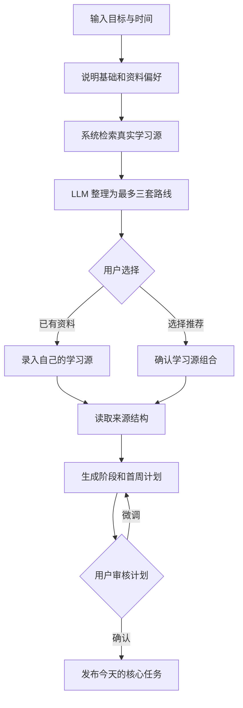
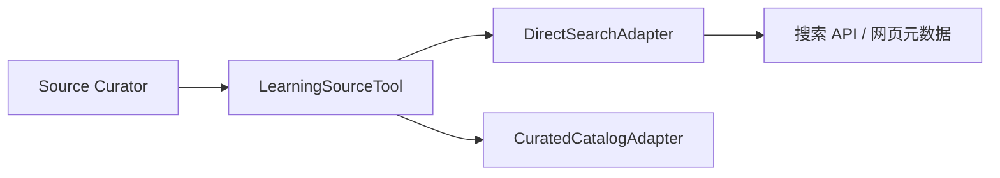

# 织梦学旅当前版本精修方案

> 版本：0.3  
> 日期：2026-09-02  
> 状态：第三轮产品设计稿，核心方向已确认  
> 原则：不追求功能数量，在现有闭环上减少错误决策、重复任务和界面噪声

## 1. 本轮设计结论

本轮只做四件事：

1. **AI 搜集学习源，用户选择学习源。** 把用户的资料搜集成本压缩为三选一的选择成本。
2. **计划围绕选定学习源生成。** 任务必须指向真实课程、教材、文档、题库或项目中的具体位置。
3. **每天全局只安排 1 个核心任务和最多 2 个可选任务。** 不再按每个目标分别发布 3+2。
4. **完成任务时可以留下一句话总结。** 总结可跳过，不增加图片、文件、测验、掌握度等完整证据系统。

继续保留：

- 三种角色和一个用户可感知的伴学 Agent；
- 当前前端专注计时和点击完成方式；
- 星图、成长值、资源和功能性道具；
- 任务编辑、拆小、替换和调轻；
- AI 失败后的规则与模板降级；
- 日志、记忆树和剧情体系。

当前明确不做：

- 服务端专注计时和复杂执行事件；
- 计划休息日、自动恢复模式和任务候选池页面；
- 图片、文件、录音等产物上传；
- 掌握度、测验系统和 FSRS；
- 商城、副本、公会和排行榜扩展；
- 多 Agent 框架；
- 数据库、鉴权和 `sessionService` 的生产化重构。

最后一项仍是已知工程风险，但不与本轮产品精修混在一起。真实多用户上线前仍需单独解决。

## 2. 产品主线

### 2.1 原来的路径

```text
输入目标
  -> AI 直接生成阶段和大量任务
  -> 用户进入首页执行
```

主要问题是 AI 不知道用户将使用什么资料，任务只能写成泛化动作，用户仍需在执行时临时搜索教材、课程和题目。

### 2.2 新路径



这条路径有两个清晰的人工确认点：

1. 确认使用什么资料；
2. 确认如何围绕资料学习。

Agent 不替用户做最终决定，也不在用户确认前发布任务、点亮星图或产生奖励。

## 3. 学习源设计

### 3.1 什么是学习源

学习源不是泛泛的“网上资料”，而是计划可以稳定引用的对象：

- 官方考试大纲或课程标准；
- 有目录结构的教材；
- 系统课程或课程播放列表；
- 官方技术文档；
- 题库、真题集或练习册；
- 项目教程、公开数据集或实践仓库；
- 用户已经购买或正在使用的资料。

新闻文章、零散问答、无法访问的链接和没有结构的营销页面不能作为核心学习源。

### 3.2 用户只提供必要偏好

目标页在当前字段基础上增加三个简短选择：

| 字段 | 示例 | 用途 |
| --- | --- | --- |
| 当前基础 | 零基础 / 学过但不系统 / 正在冲刺 | 过滤难度不合适的来源 |
| 来源偏好 | 视频 / 文字 / 题目实践 / 不限 | 决定路线形态 |
| 使用限制 | 仅免费 / 可付费 / 已有资料 | 避免推荐无法采用的内容 |

截止时间和每日可投入沿用当前注册字段。语言偏好默认跟随用户界面，不再额外提问。

页面同时提供“我已经有学习资料”。用户可以粘贴链接，或输入教材名与版本。

### 3.3 不是 LLM 直接搜索

当前 `deepseekService.js` 只调用普通 Chat Completions，没有实时网页检索。新能力必须拆为三层：


- `Search Provider` 返回真实 URL、标题和摘要；
- 校验层检查可访问性、来源方、更新时间、价格信息和目录结构；
- LLM 只能对检索结果排序、分组和解释，不能凭模型记忆新增一个来源；
- 每个展示给用户的来源都必须带真实链接和 `verifiedAt`；
- 无搜索配置或搜索失败时，从经过人工维护的来源目录中推荐；
- 两种方式都没有可靠结果时，坦诚提示用户输入已有资料，不编造课程。

建议新增：

```text
backend/src/services/learningSourceSearchService.js
backend/src/services/learningSourceRankingService.js
backend/config/learning-sources/*.json
```

当前阶段先定义 `SearchProvider` 接口，不把业务绑定到某个特定搜索厂商。

#### 是否需要 MCP

当前版本不必为搜索专门增加 MCP。MCP 解决的是模型应用与外部工具之间的标准化连接，不提供搜索结果本身。即使接入 MCP，仍然需要搜索 API、网页读取服务或来源目录作为实际数据源。

推荐当前架构：



`LearningSourceTool` 只暴露三个稳定能力：

```text
searchSources(query, preferences)
fetchSourceMetadata(url)
extractPublicOutline(url)
```

未来需要复用外部 MCP 服务时，在接口下增加适配器，不改变上层 Agent 和产品流程：


以下情况再引入 MCP 更有价值：

- 同时接入多个可替换的搜索、浏览器、文献库或课程平台工具；
- 希望工具被不同模型或其他应用复用；
- 需要模型动态发现工具及其 Schema；
- 需要独立的工具权限、授权和审计边界；
- 团队已经部署了稳定的远程 MCP Server。

当前流程固定，只有本后端使用搜索能力。直接 Adapter 更简单，也更容易控制超时、缓存、降级和成本。接口保持 MCP 可适配即可，不预先承担 MCP Client、Server、传输、授权和会话管理成本。

### 3.4 候选来源的基本校验

这些检查只决定某条来源信息是否可以被当作事实展示，不规定模型必须如何组织学习路线。

候选必须满足：

- 可以打开，或明确标注需要购买/登录；
- 标题、提供方和链接一致；
- 适合用户选择的语言和来源形态；
- 具有章节、课时、知识点或练习结构；
- 与目标和当前水平直接相关；
- 没有明显过期版本风险；
- 不使用盗版下载和来源不明的转载内容。

未经确认的价格写“价格未核实”，不能由 LLM 猜测。不能因为某个来源热门就自动判定最适合当前用户。

### 3.5 来源比较信号

不使用固定权重公式。模型根据具体目标综合判断以下信号：

- 来源是否权威可信；
- 与用户目标、基础和截止日是否匹配；
- 内容结构是否足以支撑连续计划；
- 是否包含目标所需的练习或实践；
- 用户能否接受其费用、登录和使用条件。

例如考试备考会更重视大纲和真题，编程项目会更重视官方文档和可运行示例，语言输入目标可能更重视内容质量和持续可用性。模型需要说明推荐理由，但不向用户展示伪精确分数。

### 3.6 给用户的不是十条链接，而是三套路线

默认最多提供三套来源组合：

| 路线 | 典型组合 | 适合谁 |
| --- | --- | --- |
| 系统路线 | 结构完整的课程、教材或资料组合 | 希望按完整体系推进 |
| 高效路线 | 较少来源，集中覆盖关键内容 | 时间有限，目标明确 |
| 实践路线 | 文档、教程、项目或题库的组合 | 更偏向做中学 |

如果只有一套明显可靠的路线，就只展示一套，不为凑满三项制造低质量选择。

每套路线只显示：

- 来源名称和提供方；
- 免费、付费或需要登录；
- 预计学习体量；
- 为什么适合当前目标；
- 一项需要注意的问题；
- 查看来源；
- 使用这套资料。

不展示一排内部评分、十几个标签或冗长 AI 分析。

### 3.7 来源规划的自由度

不再固定“一套核心来源 + 一套练习来源”。来源数量、角色和组合方式由模型根据目标决定，但分为三个层级：

| 层级 | 规则 | 原因 |
| --- | --- | --- |
| 硬边界 | 来源真实存在；链接和目录可验证；用户确认后才生效；历史任务不被改写 | 保护事实、用户控制权和历史一致性 |
| 软偏好 | 优先使用较少且稳定的来源；避免每天临时换资料；第一周尽量降低切换成本 | 这是默认策略，模型可以说明理由后偏离 |
| 模型自由区 | 决定来源数量、核心与辅助关系、学习顺序、不同阶段是否换来源 | 让模型根据考试、编程、语言或项目目标自适应 |

例如：

- 学习一门结构完整的课程时，模型可以只选择一个来源；
- 备考时，可以组合考试大纲、主教材和真题；
- 编程项目可以同时使用官方文档、教程和示例仓库；
- 用户已有成熟资料时，可以完全不推荐额外来源。

如果模型选择较多来源，需要在路线卡片中说明每个来源解决什么问题。用户仍只需要确认整套路线，不必逐条配置。

来源更换也不设为绝对禁止。Agent 可以主动提出替换建议，但涉及未来计划变化时必须让用户确认。已经完成的任务和历史引用保持不变。

### 3.8 必要的事实与版权边界

这部分不是限制模型如何规划，而是限制产品不能伪造或非法分发内容：

- 不重新分发受版权保护的完整教材和付费课程；
- 精确章节、页码、题号和链接必须来自可验证信息或用户提供的资料；
- 无法验证具体位置时，允许模型围绕已知主题规划，但必须标记位置未核实，不能猜造目录。

在这些边界内，模型可以自由选择来源类型、数量、组合和学习顺序。

## 4. 来源确认页

### 4.1 页面目标

用户在 30 秒内回答一个问题：**我准备用哪套资料完成这个目标？**

用户可见文案建议：

```text
先选一条可靠的学习路线
我找到了与你的目标和时间更匹配的资料，你只需要选一套。
```

### 4.2 页面结构

```text
返回                         目标摘要

先选一条可靠的学习路线
目标：30 天完成 CET-6 阅读专项
偏好：文字 + 真题，仅免费

[推荐路线，默认展开]
  本路线包含的学习来源
  适合原因
  注意事项
  查看资料
  [使用这套资料]

[其他路线，折叠]
[其他路线，折叠]

我已经有学习资料
```

不使用三张同样高、同样抢眼的并列卡片。推荐路线展开，其他路线使用紧凑列表，降低比较负担。

### 4.3 页面状态

- 搜索中：显示“正在确认来源、目录和访问条件”，不播放无意义的无限动画；
- 部分结果：明确哪些信息尚未核实；
- 无结果：引导输入已有资料，不自动跳过来源步骤；
- 链接不可访问：不允许选择，并提供重新搜索；
- 用户返回修改偏好：保留目标内容，重新筛选来源。

## 5. 围绕来源生成计划

### 5.1 来源必须进入计划上下文

确认后，每个目标保存：

```text
LearningSource {
  sourceId,
  title,
  provider,
  type,
  url,
  accessType,
  editionOrVersion,
  structure[],
  verifiedAt
}
```

计划任务增加：

```text
sourceRef: {
  sourceId,
  locatorType: CHAPTER | LESSON | SECTION | EXERCISE_SET,
  locatorLabel,
  locatorUrl
}
```

没有来源引用的任务只能是初始化、整理或复盘类任务，不能成为常规核心学习任务。

### 5.2 计划生成规则

Plan Coach 按以下顺序工作：

1. 读取目标、截止日、基础、每日时间；
2. 读取用户确认的来源组合和可验证目录；
3. 把来源内容映射到 2-6 个阶段；
4. 只细化第一周；
5. 为每个任务绑定来源位置；
6. 校验总时间、前后依赖和重复；
7. 返回计划草案，不发布任务。

任务标题必须同时说明动作、范围和来源位置，例如：

```text
阅读官方文档“组件生命周期”一节，记下 3 个触发时机
完成真题集 2025 年第 2 套仔细阅读，并核对定位句
观看课程第 4 课“极限的定义”，整理 1 个不理解的问题
```

避免：

```text
学习生命周期
巩固阅读能力
推进高数学习
完成一个学习任务
```

### 5.3 计划质量门禁

计划发布前必须通过：

- 每个常规核心任务有有效 `sourceRef`；
- 第一周所有任务总时长符合用户容量；
- 相邻任务符合来源顺序或知识依赖；
- 没有连续重复同一动作；
- 不引用来源中不存在的章节；
- 不承诺分数、掌握度或必然效果；
- 不混入用户未选择的新核心来源。

校验不通过时先规则修复，再允许 LLM 重写一次。仍失败则显示可编辑草案，不静默发布。

## 6. 计划确认页

### 6.1 页面只回答三个问题

1. 这周使用什么资料？
2. 按什么顺序推进？
3. 每天大约花多少时间？

### 6.2 页面结构

```text
本周学习计划

使用资料
核心：课程/教材名称
练习：题库名称

阶段目标
用一句具体结果说明本阶段要完成什么

周一  核心任务标题                 35 分钟
      来源：第 1 课 / 第 1 章

周二  核心任务标题                 30 分钟
      来源：第 2 课 / 练习 1

其余日期...

[调整计划]             [确认并开始]
```

不在此页展示规划质量分、星图总数、角色数值和长篇开场剧情。用户确认后，再生成简短开场并进入首页。

### 6.3 允许调整的内容

- 某一天不方便；
- 单日时间太长或太短；
- 任务顺序不合理；
- 来源不适合；
- 希望计划更稳健或更紧凑。

每次调整后展示具体变化，不只回复“已优化计划”。

## 7. 每日任务收敛

### 7.1 发布数量

全局上限：

- 1 个核心任务；
- 0-2 个可选任务；
- 所有活动目标共享同一个每日时间预算。

核心任务负责推进计划和点亮主星。可选任务可以是练习、整理或次目标行动，获得普通成长和资源，但不成为“今天必须清空”的内容。

### 7.2 选择规则

```text
先选：已确认计划中今天应推进的下一项核心任务
再选：同一来源中的必要练习或复习
最后：仍有时间时加入次目标任务
```

规则约束：

- 总预计时间不超过用户当天容量；
- 核心任务原则上不超过容量的 70%；
- 同一来源有明确先后关系时不能跳过；
- 未完成任务不会与第二天任务叠加成新的 3+2；
- 用户手动编辑后仍保留原来源引用；
- AI 只负责把确认计划中的节点写得更具体，不再每天自由发明五项任务。

当前版本不增加恢复模式和候选池页面。已有“拆小、替换、调轻、移动到明天”继续承担人工调整。

### 7.3 多目标

- 用户可以保留多个目标；
- 首页每天仍只有一个全局核心任务；
- 用户在目标工作台设置主目标和次目标；
- 核心任务默认来自主目标；
- 次目标只在有剩余容量时进入可选任务；
- 其他目标不自动发布任务，但历史进度保留。

### 7.4 星图映射

- 一颗主星对应一个完成的核心任务；
- 可选任务不点亮主星；
- 每张星图仍保留 15 颗主星；
- 新目标不再按 `持续天数 × 3` 预建星星；
- 旧账号已完成的星星保持不变，未完成的未来星位按新规则逐步释放；
- 完成来源绑定的核心任务后，星星详情保存来源名称；用户填写总结时一并保存。

## 8. 一句话总结

### 8.1 不改专注页

当前专注倒计时、暂停、休息和结束逻辑保持不变。本轮不新增服务端计时，也不以专注时长判断真假完成。

### 8.2 只精修完成页

任务结束后，完成页提供一个可跳过的总结入口：

```text
用一句话留下今天的收获
例如：我终于分清了进程和线程的资源边界。
```

交互规则：

- 所有任务都允许不填写总结；
- 用户填写时限制为 5-100 个字符；
- 页面主按钮为“完成并结算”，输入框下提供低权重的“暂不总结”；
- 提交后沿用当前奖励和剧情结算；
- AI 不评价总结正确与否；
- 有总结时才写入任务历史、日志和最近记忆；
- 跳过总结不扣奖励、不影响点星，也不触发提醒；
- 后续计划可利用总结中的“不理解、卡住、需要再看”等明确表述，但不能推断掌握度。

任务完成接口最小改动为：

```json
{
  "summary": "我理解了二分查找循环边界为什么容易写错。"
}
```

`summary` 为可选字段，可以省略或传空字符串。

重复完成、奖励和星图逻辑继续由后端确定性处理。

## 9. Agent 设计

### 9.1 一个角色，六种后台能力

用户看到的仍是当前选择的一个角色。后台能力拆分是职责划分，不是六个 Agent 轮流对话。

| 能力 | 当前迭代职责 | 是否新增模型调用 |
| --- | --- | --- |
| Source Curator | 生成检索意图，比较真实来源，整理三套路线 | 是 |
| Plan Coach | 围绕确认来源生成阶段和首周草案 | 调整现有调用 |
| Daily Scheduler | 从确认计划中选择全局 1+2 | 默认规则，不调用 |
| Execution Coach | 继续提供拆小、替换、调轻 | 复用现有能力 |
| Narrative Renderer | 生成开场和完成剧情 | 复用，降低优先级 |
| Memory Curator | 保存来源选择和用户自愿填写的总结 | 复用现有记忆树 |

### 9.2 Source Curator 的严格边界

Source Curator 可以：

- 把目标转换成检索关键词；
- 从检索结果中去重和归类；
- 根据用户基础、时间和费用偏好排序；
- 解释每套来源组合的优点和限制。

Source Curator 不可以：

- 输出检索服务没有返回的课程或链接；
- 猜测价格、版本、目录和可访问性；
- 自动替用户选择；
- 把搜索摘要当作完整课程内容；
- 在计划中偷偷加入用户未确认的来源。

### 9.3 Prompt 上下文

计划 Prompt 只携带必要内容：

```text
用户目标
截止日和每日时间
当前基础与来源偏好
已确认来源及其可验证结构
最近完成任务和可选的一句话总结
当前阶段
```

角色人格只影响解释和叙事风格，不影响来源可信度排序、任务数量和计划时间。

### 9.4 确定性规则继续掌权

后端规则负责：

- 来源必须来自检索结果或用户输入；
- 计划确认状态；
- 每日 1+2 上限和总时间；
- 任务、星图、奖励和幂等；
- 未确认计划不能发布；
- LLM 失败时的目录降级和规则任务。

## 10. 数据模型的最小调整

本轮继续使用当前 JSON Store，不做数据库迁移，只增加必要字段。

### 10.1 Goal

```text
goal.sourcePreferences
goal.learningSources[]
goal.selectedSourceBundleId
goal.planStatus: DRAFT | CONFIRMED
goal.planConfirmedAt
goal.priority: PRIMARY | SECONDARY | INACTIVE
```

### 10.2 Planning Node

```text
node.sourceRef
node.priorityTier: CORE | OPTIONAL
node.selectionReason
```

### 10.3 Task

```text
task.sourceRef
task.priorityTier
task.completionSummary
```

旧 `goalPlan` 与 `goalPortfolio` 的完全合并不在本轮实施，但所有新增来源字段只写入 `goalPortfolio.goals[]`，禁止继续给两套模型各加一份来源状态。`goalPlan` 只保留旧流程兼容。

## 11. API 最小调整

| 方法 | 路径 | 用途 |
| --- | --- | --- |
| `POST` | `/api/goal-drafts` | 创建目标和来源偏好草稿 |
| `POST` | `/api/goal-drafts/{id}/source-searches` | 检索、校验并生成来源路线 |
| `POST` | `/api/goal-drafts/{id}/source-selections` | 保存用户确认的来源组合 |
| `POST` | `/api/goal-drafts/{id}/plan-generations` | 围绕来源生成计划草案 |
| `POST` | `/api/goal-drafts/{id}/confirmations` | 确认计划并正式创建目标 |
| `POST` | `/api/tasks/{id}/completion` | 增加 `summary` 字段 |

来源搜索请求允许同步返回。建议设置 12 秒超时，失败后立即使用人工目录或提示用户录入已有来源。本轮不为它引入任务队列和复杂异步工作流。

## 12. 现有页面的渐进式精修

### 12.1 视觉审计

当前值得保留：

- 浅蓝水彩背景；
- 深色金色星图；
- 三个角色形象和悬浮伴学；
- 蓝色主操作色；
- 圆润、友好的学生产品气质。

当前需要收敛：

- 首页标题“Todo”和中文产品语境不一致；
- 所有任务卡片视觉权重接近，用户看不出今天最重要的一项；
- 任务开始前展示奖励，注意力从学习价值转向数值；
- 首页快捷菜单同时放四个动作，且文案仍宣传每目标 3+2；
- 目标工作台同时展示目标切换、三组指标、规划分、阶段、五个任务、七日节奏和调轻入口，密度过高；
- 规划质量分是内部指标，不应要求用户理解；
- 英文微标签与中文核心文案混用；
- 40rpx、44rpx、30rpx 等圆角和多种渐变缺少统一规则；
- `glass-card`、阴影和卡片使用过多，层级反而不清晰。

### 12.2 视觉规则

- 保持浅色主题，不新增深浅主题切换；
- 全局主色固定为当前蓝色，金色只用于星图和真正完成状态；
- 普通页面不再使用紫色、绿色等多套渐变区分普通功能；
- 面板圆角统一为 28rpx，按钮 20rpx，小标签使用全圆角；
- 一个页面最多一个主要高阴影容器，其余用留白和细分隔组织；
- 动效只用于点击反馈、选择切换和完成状态，时长 160-220ms；
- 不引入持续漂浮、跑马灯和装饰性粒子；
- 文字优先使用现有系统中文字体，不额外加载网络字体。

### 12.3 首页

结构改为：

```text
今天
目标名 / 当前阶段                              调整

[核心任务，大卡片]
来源位置
预计时间
为什么今天做
[开始]

有余力再做
[可选任务，紧凑行]
[可选任务，紧凑行]

伴学的一句话
```

具体变化：

- “Todo”改为“今天”；
- 核心任务使用唯一大卡片，可选任务改为紧凑列表；
- 不在任务卡展示成长和资源奖励；
- 首页只显示当前阶段，不同时显示“章节、目标、并行目标数量”等多层标题；
- 右上角加号只保留“新建目标”和“自定义任务”；
- 目标工作台和调整今天改为页面内文字入口；
- 悬浮伴学保留，但默认气泡不展开，不遮挡任务；
- 加载、空目标、来源失效和计划未确认都有独立状态。

### 12.4 目标工作台

- 首屏展示目标、主/次状态、确认来源和当前阶段；
- 删除用户不可理解的规划质量分；
- 今日任务不在工作台重复展示完整卡片，只提供“返回今天”；
- 七日区只展示已确认的核心任务顺序；
- 星图指标保留一个，不同时展示三组相近数字；
- 新建目标不再弹出两字段 Modal，跳转到完整的目标与来源流程。

### 12.5 初始化结果页

当前“世界入口已开启”页面改到计划确认之后。内容顺序为：

1. 已确认目标；
2. 已选择学习源；
3. 第一项核心任务；
4. 一段短开场；
5. “开始第一项”按钮。

不再在来源和计划尚未确认时先展示长篇开场和初始任务。

### 12.6 完成页

- 去掉模拟四阶段进度文案；
- 完成页提供可跳过的一句话总结；
- 点击“完成并结算”后显示简短完成反馈；
- 剧情正文默认折叠为“查看本次故事”；
- 返回首页是唯一主操作。

## 13. 现有代码落点

### 13.1 后端

| 文件 | 调整 |
| --- | --- |
| `deepseekService.js` | 保持普通 LLM 适配，不伪装成搜索能力 |
| 新增 `learningSourceSearchService.js` | 调用 SearchProvider、去重、校验、目录降级 |
| 新增 `learningSourceRankingService.js` | 让 LLM 只比较真实候选 |
| `goalPlanningService.js` | Prompt 加入确认来源和目录，任务输出 `sourceRef` |
| `portfolioPlanningService.js` | 从固定每目标 3+2 改为全局 1+2 发布规则 |
| `sessionService.js` | 增加 Goal Draft 状态和确认命令，不做整体拆分 |
| `apiContract.js` | 增加来源、草案、优先级和总结 DTO |
| `apiRoutes.js` / `app.js` | 增加草稿、搜索、选择和确认接口 |

### 13.2 小程序

| 页面 | 调整 |
| --- | --- |
| `features/account/register` | 增加基础、来源偏好、费用限制 |
| 新增 `features/goal/source-select` | 三套来源路线选择 |
| 新增 `features/goal/plan-review` | 第一周计划审核确认 |
| `pages/home` | 核心任务与可选任务分层 |
| `features/adventure/goal-map` | 展示来源和确认计划，降低信息密度 |
| `features/adventure/focus` | 不修改 |
| `features/adventure/completion` | 增加一句话总结，精简结算展示 |

## 14. 实施顺序

### A. 来源选择与计划确认，5-7 个工作日

- Goal Draft 状态；
- SearchProvider 接口和内置来源目录；
- 来源校验、三套路线和用户选择；
- 来源绑定的计划生成；
- 计划审核和确认页；
- 5 个典型目标的来源与任务质量测试。

### B. 每日任务收敛，3-5 个工作日

- 主目标和次目标；
- 全局 1 核心 + 最多 2 可选；
- 首页信息层级；
- 星图从 3 星/日过渡到 1 个核心行动/星；
- 旧账号未来星位兼容。

### C. 一句话总结与视觉精修，3-4 个工作日

- 完成页总结字段；
- 日志和记忆接入总结；
- 目标工作台减法；
- 文案、色彩、圆角、阴影和页面状态统一；
- 当前主流程回归测试。

预计总工作量：11-16 个工作日。1 名后端和 1 名小程序开发可在约 3 个自然周完成。若单人实施，预计 4-5 周。

## 15. 验收标准

### 15.1 来源

- 所有推荐来源都有可打开的真实链接或明确登录/付费状态；
- LLM 不能展示检索结果之外的来源；
- 用户最多比较三套路线；
- 用户可以输入自己的来源；
- 搜索失败有目录降级或明确无结果状态；
- 来源、版本和校验时间写入目标状态。

### 15.2 计划

- 常规核心任务全部绑定确认来源及具体位置；
- 未确认计划不会发布任务；
- 第一周任务总时长符合用户每日容量；
- 计划不会混入未选择的新核心来源；
- 用户能在确认前修改来源、顺序和时长。

### 15.3 每日任务

- 所有目标合计最多 1 个核心任务和 2 个可选任务；
- 首页能在首屏明确指出唯一核心任务；
- 可选任务不以“未清空”制造失败感；
- 核心任务完成后只点亮一颗主星；
- 当前专注页行为保持不变。

### 15.4 总结与 Agent

- 所有任务均可跳过总结，跳过不影响奖励和点星；
- 用户填写 5-100 字总结时，内容写入任务历史、日志和最近记忆；
- Agent 不评价总结正确率，不生成掌握度；
- 来源搜索、计划生成、每日发布和奖励裁决的责任边界可测试；
- LLM 或搜索失败不破坏已有目标和已完成记录。

### 15.5 界面

- 首页不再显示“Todo”和固定 3+2 文案；
- 一个页面只有一个明确主操作；
- 普通页面只使用统一蓝色主色，金色只用于星图/完成；
- 卡片、按钮和标签遵守统一圆角规则；
- 搜索、空结果、链接失效、未确认、加载和错误状态完整；
- 伴学悬浮控件不遮挡核心任务按钮。

## 16. 审核结果与技术决定

| 编号 | 已确认决定 |
| --- | --- |
| R1 | 最多展示三套来源路线；每套包含多少来源及其角色由模型按目标决定 |
| R2 | 保留主目标 + 次目标，其余目标暂停自动发布 |
| R3 | 所有任务总结均可跳过；填写后才进入日志和 Agent 记忆 |
| R4 | 一颗主星对应一个核心任务，15 个核心行动完成一张星图 |
| R5 | 使用 SearchProvider 接口并以人工来源目录降级 |
| T1 | 当前迭代不引入 MCP；使用 `LearningSourceTool + DirectSearchAdapter`，预留 `McpSearchAdapter` 扩展点 |

至此产品方向已经确定。下一步可以进入页面线框、数据结构和研发任务拆解，不再需要增加新的产品功能。
