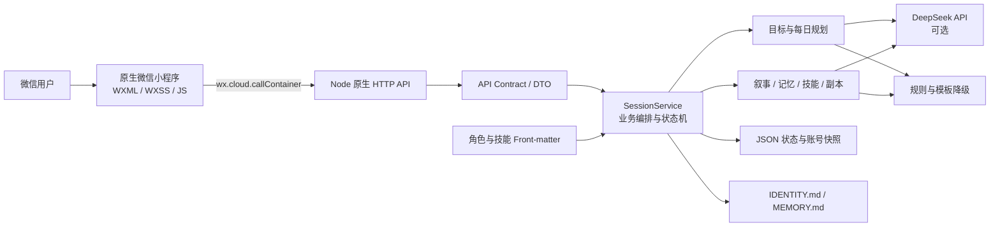
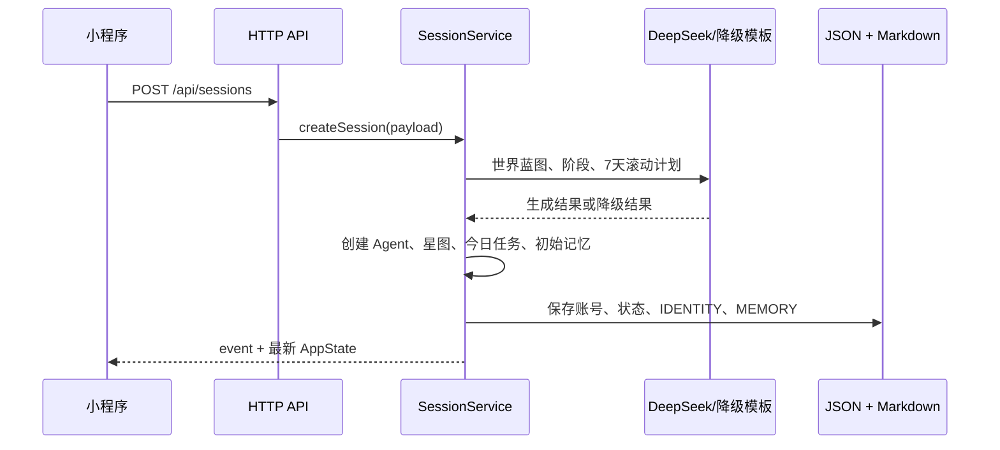

# 织梦学旅（自律者联盟）项目功能与架构全景

> 文档基线：2026-09-01 当前仓库源码。本文描述的是代码的实际行为，而不是早期方案中的预期功能。若本文与 `AIGC初步方案.md`、旧版后端文档冲突，以源码与本文为准。

## 1. 项目概览

织梦学旅是一款原生微信小程序形态的 AI 学习冒险 Demo。它把长期学习目标拆成每天可执行的任务，再把任务完成记录转译成角色成长、冒险叙事、星图收集和记忆档案。

当前产品闭环是：

1. 用户注册、选择角色并输入长期目标；
2. 后端生成世界观、阶段计划和未来 7 天的具体任务；
3. 每个并行目标每天释放 3 个主线任务和 2 个支线任务；
4. 用户通过专注页完成任务，获得成长值、资源点和剧情；
5. 主线任务点亮星星，每 15 颗主线星组成一张星图；
6. 完整星图进入图鉴并奖励可作用于真实任务的星宿道具；
7. 日志、Agent 记忆树和世界实体持续沉淀学习历程。

这是比赛/MVP 代码，不是生产级多租户服务。当前后端使用单进程、单活动会话和本地 JSON/Markdown 文件持久化。

## 2. 功能现状

| 能力 | 状态 | 说明 |
| --- | --- | --- |
| 注册、登录和账号状态恢复 | 已接入 | 账号密码注册；登录后恢复该账号最近一次完整状态快照 |
| 三种角色与差异化 Agent | 已接入 | 守望骑士、奥术学者、荒野旅人；影响叙事、技能和副本基础数值 |
| AI 目标规划与规则降级 | 已接入 | DeepSeek 可生成目标蓝图、阶段、滚动任务和叙事；无 Key 或生成失败时使用确定性规则/模板 |
| 并行长期目标 | 已接入 | 每个目标拥有独立进度、滚动规划、星位和星图系列 |
| 每日任务 | 已接入 | 每个活动目标每天 3 主线 + 2 支线；同日重复读取幂等，跨日归档并续排 |
| 任务专注、编辑和调轻 | 已接入 | 倒计时专注、编辑标题/描述/时长/截止日、拆小、替换和轻量模式 |
| 任务完成与成长结算 | 已接入 | 结算成长值、资源点、技能、超时 Debuff、等级、剧情和记忆 |
| 星图、图鉴和星宿道具 | 已接入 | 15 颗主线星一张图；完成后奖励专注、拆解、复习、复盘或保底工具 |
| 角色日志与下一步建议 | 已接入 | 展示剧情/奖励，可刷新 AI 建议或把建议采纳为支线任务 |
| 角色档案 | 已接入 | 展示等级、成长、资源、目标概览、真实指标、技能和背包 |
| 商店购买 | 后端具备 | API 和结算逻辑存在，当前小程序没有商店入口 |
| 夜间剧情副本 | 后端和页面具备，入口未接入 | 22:00 时间门、角色分支、结算和防重复奖励均已实现；当前 Tab 是星图，没有调用副本启动接口的 UI |
| 旧 Flask 后端 | 仅参考 | `backend/fallback-python/` 不属于当前正式运行链路 |
| MySQL | 仅设计 | 有设计文档和 Schema，当前没有数据库实现 |

## 3. 用户侧功能

### 3.1 首次进入与账号

- 欢迎页提供“创建角色”和“登录已有账号”。
- 注册流程依次完成角色选择、账号密码、昵称、目标期限和每日投入时长。
- 初始化时后端创建 Agent、目标计划、第一张长期目标星图、今日任务、开篇叙事和运行时档案。
- 初始化请求若在服务端提交账号后发生网络中断，前端会自动尝试登录恢复，避免用户被卡在半完成状态。
- 小程序本地只保存登录标记、角色/伴学显示和悬浮球位置；业务状态以服务端为准。

### 3.2 角色与 Agent

| 角色 | Agent | 叙事主题 | 初始特色 |
| --- | --- | --- | --- |
| 守望骑士 | Aegis-07 | 王城、徽记、试炼、结界 | 连续专注触发成长和防御类增益 |
| 奥术学者 | Lyra-Archive | 卷轴、档案、回廊、知识核心 | 25 分钟学习块触发成长和护盾增益 |
| 荒野旅人 | Nomad-Delta | 罗盘、营地、遗迹、补给线 | 完成支线获得额外资源和攻击增益 |

角色配置来自 `backend/config/agents/roles/*.md`，技能配置来自 `backend/config/agents/skills/*.md`。文件使用 YAML Front-matter 保存机器可读字段，Markdown 正文保存叙事指令。后端启动时解析、校验并缓存目录内容。

角色弧光按等级变化：1—10 级为新手期，11—30 级为进阶期，31 级以上为大师期。当前弧光会参与后续提示词和 Agent 档案生成。

### 3.3 长期目标与滚动规划

当前规划包含两个相关模型：

- `goalPlan`：单个主目标的阶段化骨架，保存长期目标、阶段和阶段必做任务。它也是旧账号迁移、章节终章和夜间副本上下文的基础。
- `goalPortfolio`：当前前端主要使用的并行目标集合。每个目标独立维护天数、阶段蓝图、周里程碑、滚动任务、星位和星图系列。

新目标的规划流程：

1. 生成或降级得到阶段计划；
2. 将阶段映射为覆盖整个目标周期的 `phases` 和每周 `weeklyMilestones`；
3. 只细化当前起连续 7 天的任务，避免一次生成整个周期；
4. 每天配置 `LEARN`、`PRACTICE`、`VERIFY` 三类主线任务；
5. 通过动作性、具体度、角色覆盖和重复度校验，不合格任务由规则修复；
6. 随日期前移补充窗口末端的新一天。

目标时长允许 1—365 天。每个目标每天对应 3 颗主线星，因此总星数为 `durationDays × 3`。每 15 颗星划为一张星图，多个目标可以同时进行，并在同一天分别释放自己的任务组。

### 3.4 今日任务与专注

- 首页展示当前全部活动目标释放的任务，以及用户自建支线。
- 目标工作台按目标查看今日 3 主线 + 2 支线、七日节奏、阶段、周里程碑和规划质量分。
- 同一自然日重复刷新不会重建任务；跨日时完成项进入 `taskHistory`，日报摘要进入 `dailyPlanHistory`，未完成项会携带到新日报。
- 用户可新建临时支线、修改任务内容和预计时长、移动截止日期、要求 AI 拆小/替换任务，或把未完成任务批量缩短到最多 15 分钟。
- 专注页使用前端倒计时。倒计时结束后跳转完成页，由完成页调用后端结算；计时本身不构成服务端完成证据。

### 3.5 任务结算

后端是奖励和状态推进的唯一裁决者。一次完成操作会：

1. 拒绝不存在或重复完成的任务；
2. 标记执行任务和关联星位/阶段任务完成；
3. 计算基础成长值、资源点和超时惩罚；
4. 判定角色技能并应用额外奖励与副本临时 Buff；
5. 处理升级、星图完成和星宿道具发放；
6. 生成 AI 或降级剧情、记忆摘要和世界实体；
7. 写入日志、线性记忆、树状记忆、世界状态以及 Agent Markdown 档案；
8. 返回统一的 `event + state` 命令结果。

任务超时后成长值按基础值的 70% 结算。支线可以获得奖励和剧情，但目标关联支线不会点亮主线星。

### 3.6 星图、图鉴与道具

星图页包含三个视图：当前星图、已完成图鉴、星宿道具。

完成一张星图后，它会永久进入图鉴，并按收集顺序循环发放以下道具：

| 道具 | 作用对象 | 效果 |
| --- | --- | --- |
| 专注披风 | 未完成任务 | 打开 25 分钟专注模式 |
| 洞察卷轴 | 未完成任务 | 将困难任务拆为三个可执行步骤 |
| 记忆符印 | 已完成任务 | 安排第 1、3、7 天间隔复习 |
| 回溯之镜 | 已完成任务 | 生成 15 分钟复盘任务 |
| 守护契约 | 未完成任务 | 生成 5 分钟保底版本，原任务保持未完成 |

道具次数由后端扣减，前端只根据命令结果执行导航或刷新。

### 3.7 日志、记忆和世界状态

- `diary` 是用户可见的事件流，记录初始化、任务、规划调整、剧情终章、购买和副本等事件。
- `memories` 是按时间记录的完整 Agent 记忆。
- `memoryTree.l1Recent` 保留最近 8 条短记忆，用于即时叙事连贯。
- `memoryTree.activeSeason` 保存当前目标赛季及任务记忆、章节终章。
- `memoryTree.seasonArchives` 保存压缩后的赛季史诗和摘要。
- `memoryTree.permanentTitles` 保存跨赛季继承的永久称号。
- `worldState` 以 Key-Value 形式保存可返场的物品、NPC、地点和其他实体。

每次重要状态变化都会同步生成：

- `backend/runtime/agents/<agentId>/IDENTITY.md`
- `backend/runtime/agents/<agentId>/MEMORY.md`

这两个文件是可读的 Agent 工作空间快照，不是唯一事实源；完整状态仍在 JSON Store 中。

### 3.8 夜间副本与商店的实际接入情况

夜间副本服务支持：

- 默认 22:00 开启，演示模式可绕过时间门；
- 按角色加载不同的多节点剧情和选项条件；
- 启动时冻结当日计划、学习阶段和已完成任务快照；
- 按整备、部分推进、今日全清、阶段突破四条路线计算奖励；
- 事件选择只更新洞察/羁绊/决意等剧情状态，不即时发正式奖励；
- 结算时由 AI 或模板生成结局，固定奖励由后端计算；
- 演示、同一日报重玩不发奖励，副本也不增加连续天数。

但当前小程序没有调用 `startDungeon()` 的页面入口，`dungeon-run` 和 `dungeon-settlement` 只能在已有运行状态下继续。因此它属于“后端和页面已实现、产品导航未接通”的能力。

商店的商品、购买 API、资源扣减、背包和世界实体写入已实现，但当前前端仅展示背包，没有购买页面。

## 4. 系统架构



### 4.1 技术栈

- 前端：原生微信小程序，WXML + WXSS + CommonJS JavaScript + JSON。
- 网络：`wx.cloud.callContainer()` 调用微信云托管服务。
- 后端：Node.js 18+，仅使用 Node 内置 `http`、`fs`、`path`、`crypto`、`fetch` 等能力，没有第三方运行时依赖。
- AI：兼容 OpenAI Chat Completions 形态的 DeepSeek 接口，默认模型 `deepseek-chat`。
- 持久化：JSON 文件 + Markdown Agent 工作空间。
- 部署：Docker，生产镜像基于 `node:22-alpine`，提供 `/healthz` 健康检查。

### 4.2 前端分层

| 目录 | 职责 |
| --- | --- |
| `miniprogram/app.js` | 初始化微信云能力，保存页面间临时状态 |
| `miniprogram/pages/` | 欢迎页与首页、日志、星图、我的四个 Tab |
| `miniprogram/features/account/` | 登录、角色选择、注册、初始化和结果页分包 |
| `miniprogram/features/adventure/` | 专注、完成、目标工作台、副本运行和结算分包 |
| `miniprogram/services/api.js` | 唯一远端 API 入口，统一封装容器调用、响应解包和错误处理 |
| `miniprogram/utils/` | 本地存储、角色视觉、星图形状和 UI 映射 |
| `miniprogram/assets/` | 角色、故事、图标与欢迎页图片 |

页面间短期对象（注册参数、当前专注任务、待结算任务）放在 `getApp().globalData`；登录标记和 UI 偏好放在 `wx` 本地存储；页面展示所需的完整业务状态每次通过 `GET /api/sessions/current` 刷新。

### 4.3 后端分层

| 层 | 主要文件 | 职责 |
| --- | --- | --- |
| 启动与路由 | `backend/server.js`、`src/app.js` | 初始化配置目录和运行时 Store，匹配 HTTP 方法/路径，转换异常 |
| HTTP/契约 | `src/lib/http.js`、`apiRoutes.js`、`apiContract.js` | JSON/CORS、请求体解析、路由常量、内部模型到 DTO 的边界转换 |
| 业务编排 | `src/services/sessionService.js` | 账号会话、规划、任务、星图、奖励、购买、副本、迁移和持久化的主状态机 |
| 规划 | `goalPlanningService.js`、`portfolioPlanningService.js`、`dailyPlanService.js` | 目标分类/阶段、7 天滚动计划、质量门禁、每日发布和降级规则 |
| Agent/叙事 | `agentCatalogService.js`、`goalBlueprintService.js`、`narrativeService.js` | 配置加载、世界初始化、任务/终章/赛季叙事 |
| 成长与记忆 | `skillEngineService.js`、`characterArcService.js`、`memoryTreeService.js`、`worldStateService.js` | 技能判定、等级弧光、分层记忆和实体返场 |
| 副本 | `dungeonProgressService.js`、`dungeonNarrativeService.js`、`constants/dungeonStorylines.js` | 学习快照映射、固定奖励、分支剧情和结算文本 |
| 存储 | `src/store/sessionStore.js`、`accountStore.js`、`runtimeSecrets.js` | 活动状态、账号索引、账号快照和进程内临时 Key |
| 工作空间 | `agentWorkspaceService.js` | 输出可读的 IDENTITY/MEMORY Markdown |
| 静态内容 | `src/constants/`、`backend/config/agents/` | 商店、星图道具、故事图、角色故事线、角色和技能配置 |

`sessionService.js` 是系统的聚合根：几乎所有写操作都在同一进程内直接修改活动状态，完成派生计算后调用 `saveStore()`。其他 Service 大多是纯计算、AI 适配或特定领域操作。

## 5. 核心数据与状态

### 5.1 活动状态

`backend/runtime/session-store.json` 保存当前活动状态，核心字段如下：

| 字段 | 含义 |
| --- | --- |
| `meta` | Store 版本、递增 ID 和更新时间 |
| `profile`、`stats`、`agent` | 用户目标、成长数值和 Agent 当前状态 |
| `tasks`、`taskHistory` | 当前执行任务与历史任务 |
| `goalPlan` | 单目标阶段骨架 |
| `goalPortfolio` | 并行目标、滚动计划、星位和星图系列 |
| `dailyPlan`、`dailyPlanHistory` | 当日报和最近历史日报 |
| `diary`、`memories` | 用户日志和完整 Agent 记忆 |
| `skillState`、`inventory`、`shop` | 技能触发、背包和商品 |
| `starMap` | 已收集星图、道具次数和计划中的间隔复习 |
| `dungeon`、`dungeonRun`、`dungeonSettlementHistory` | 副本面板、本轮快照和防重结算记录 |
| `memoryTree`、`worldState` | L1/L2/L3 记忆与可返场实体 |
| `transition` | 旧单目标主线完成后的新目标提示状态 |

Store 带有从早期结构迁移到当前版本（`meta.version = 8`）的兼容逻辑，会在读取状态时补齐缺失字段、修复过短目标和同步衍生结构。

### 5.2 账号存储

- `account-store.json` 保存账号名、用户 ID、昵称、SHA-256 密码摘要和时间戳。
- `accounts/<userId>.json` 保存该账号的完整状态快照和可选的会话级 AI Key。
- 登录时认证账号，加载快照并替换进程中的全局活动状态。
- 每次保存活动状态时，同时更新当前账号快照。

这套设计适合单实例演示，但不支持真正的并发多用户隔离，详见“已知边界”。

### 5.3 DTO 边界

内部模型不会原样返回前端。`apiContract.js` 将其转换为稳定的 `AppStateDto`、`CommandResultDto`、`DungeonStatusDto` 等：

- 查询接口返回 `data = AppStateDto/其他 DTO`；
- 写接口返回 `data = { event, state }`；
- `event` 提供机器可读标签、故事、奖励、角色弧光、图片和前端动作；
- `state` 是命令执行后的最新公开状态。

统一响应：

```json
{
  "code": 200,
  "message": "状态同步成功",
  "success": true,
  "data": {}
}
```

## 6. AI 与确定性业务的边界

AI 负责：

- 开篇世界观、章节标题和主线摘要；
- 目标阶段和滚动任务建议；
- 任务完成、支线、章节终章、赛季归档和副本结局文本；
- 记忆摘要与可能返场的世界实体。

后端规则负责：

- 账号、任务状态和幂等；
- 每日发布数量、滚动窗口和质量门禁；
- 成长、资源、等级、技能和超时惩罚；
- 星位、星图、道具次数和间隔复习日期；
- 副本开放时间、路线、奖励资格和防重复结算；
- 所有文件持久化。

当 `DEEPSEEK_API_KEY` 未配置时，相关服务返回规则/模板结果，核心业务仍可运行。大部分生成服务也捕获模型错误后自动降级；DeepSeek 不拥有任务完成或奖励裁决权。

## 7. HTTP API

Base URL：`http://127.0.0.1:3001`；业务前缀：`/api`。

| 方法 | 路径 | 主要输入 | 用途 |
| --- | --- | --- | --- |
| `GET` | `/`、`/healthz` | 无 | 容器健康检查 |
| `GET` | `/api/roles` | 无 | 获取公开角色列表 |
| `POST` | `/api/sessions` | `account,password,name,goal,deadline,dailyTime,roleId` | 注册并初始化世界 |
| `POST` | `/api/session-logins` | `account,password` | 登录并恢复账号状态 |
| `GET` | `/api/sessions/current` | 无 | 获取当前完整公开状态，并触发必要的迁移/每日计划生成 |
| `POST` | `/api/tasks` | `title` | 新建自定义支线 |
| `POST` | `/api/tasks/{taskId}/edits` | `title,detail,estimatedMinutes,deadlineAt` | 编辑未归档的当前任务 |
| `POST` | `/api/tasks/{taskId}/completion` | 无 | 完成任务并执行完整结算 |
| `POST` | `/api/goals` | `title,durationDays` | 新建并行长期目标 |
| `POST` | `/api/goals/advance` | `goal,deadline?,dailyTime?` | 归档旧单目标赛季并进入新主线 |
| `POST` | `/api/goals/replan` | `reason,taskId?,newGoal?` | 拆小、替换、调轻或改换方向 |
| `POST` | `/api/goals/next-suggestion` | `completedTaskId?` | 刷新下一步建议 |
| `POST` | `/api/goals/adopt-suggestion` | `suggestion?` | 将建议采纳为支线 |
| `GET` | `/api/dungeons/current/status?demo=0|1` | 查询参数 | 查询时间门、副本面板和当前运行 |
| `POST` | `/api/dungeons/current/start` | `demo` | 冻结今日快照并启动副本 |
| `POST` | `/api/dungeons/current/events` | `choiceId` | 推进副本分支 |
| `POST` | `/api/dungeons/current/settlement` | 无 | 结算副本 |
| `POST` | `/api/star-map/tools/uses` | `toolId,taskId` | 使用星宿道具 |
| `GET` | `/api/agents/current` | 无 | 获取 Agent 档案及配置路径 |
| `GET` | `/api/agents/current/memories` | 无 | 获取记忆、Markdown、记忆树和世界状态 |
| `POST` | `/api/purchases` | `itemId` | 购买商店道具 |

当前路由没有令牌或用户 ID 参数，所有“current”接口都作用于进程中的活动账号。

## 8. 关键运行流程

### 8.1 初始化



账号注册被放在所有异步初始化之后：若世界/计划生成失败，不会留下只能登录却没有完整世界的“幽灵账号”。

### 8.2 每日刷新

`GET /api/sessions/current` 不只是只读查询，它还会执行状态维护：旧状态迁移、目标形状修复、星图奖励补发、间隔复习物化、跨日归档、滚动窗口补齐、今日任务发布和超时叙事更新。因此该接口具有持久化副作用。

### 8.3 任务完成

`completeTask()` 先更新确定性业务状态，再请求叙事，最后统一保存。公开结果中同时带事件和最新状态，前端无需拼接本地奖励。主线星图进度与旧阶段主线进度是两条兼容路径：带 `portfolioNodeId` 的当前任务推进星图；无星图关联的旧任务推进 `goalPlan` 阶段和章节终章。

## 9. 目录结构

```text
AIGC-cloudrun-ready/
├─ backend/
│  ├─ config/agents/          # 角色、技能 Front-matter + Prompt
│  ├─ docs/                   # 旧后端/API/MySQL/Agent 专题文档
│  ├─ fallback-python/        # 旧 Flask 参考实现
│  ├─ runtime/                # 运行期 JSON 与 Agent Markdown（Git 忽略）
│  ├─ src/
│  │  ├─ config/              # 环境变量
│  │  ├─ constants/           # 商店、星图、故事图、副本故事线
│  │  ├─ lib/                 # HTTP、路由、DTO、Front-matter 解析
│  │  ├─ services/            # 领域服务和业务编排
│  │  ├─ store/               # 文件 Store 与账号快照
│  │  └─ utils/
│  ├─ tests/                  # Node assert 回归测试
│  └─ server.js               # 正式入口
├─ miniprogram/               # 原生微信小程序
├─ tools/                     # 小程序静态校验和本地 API 冒烟脚本
├─ submission_assets/         # 参赛说明书流程图与 UI SVG
├─ docs/PROJECT_OVERVIEW.md   # 本文
├─ Dockerfile
├─ package.json
└─ project.config.json
```

工作区外层还有一份 `project.config.json`，但完整应用根目录是 `AIGC-cloudrun-ready/`；Node 命令和微信开发者工具均应以该目录为项目根。

## 10. 配置、启动和部署

### 10.1 环境变量

| 变量 | 默认值 | 说明 |
| --- | --- | --- |
| `NODE_ENV` | `development` | 环境标识 |
| `HOST` | `0.0.0.0` | 监听地址 |
| `PORT` | `3001` | 服务端口 |
| `RUNTIME_DIR` | `backend/runtime` | 运行时状态目录，相对路径从 `backend/` 解析 |
| `DEEPSEEK_API_KEY` | 空 | 空时使用规则/模板降级 |
| `DEEPSEEK_API_URL` | DeepSeek Chat Completions 地址 | 模型服务地址 |
| `DEEPSEEK_MODEL` | `deepseek-chat` | 模型名 |

小程序的 `miniprogram/config/cloud.js` 配置微信云环境 ID 和云托管服务名。AI Key 只应放在服务端环境变量中。

### 10.2 本地命令

在 `AIGC-cloudrun-ready/` 下运行：

```bash
npm start
npm run check
npm run test:daily-plan
npm run test:star-map
npm run test:goal-guard
npm run test:goal-portfolio
npm run test:portfolio-planning
node backend/tests/dungeon-daily.test.js
```

`npm run check` 会检查全部后端 JavaScript 语法，并校验小程序页面四件套、JSON、模块引用、导航、图片、Secret、`callContainer` 使用和分包体积。`smoke:miniprogram-api` 会启动本地后端并对小程序所依赖的 API 做冒烟测试。

### 10.3 容器

Docker 镜像只复制 `package.json` 和 `backend/`，以非 root 的 `node` 用户运行，暴露 3001 端口，并每 30 秒访问 `/healthz`。`miniprogram/` 不进入后端镜像。

## 11. 测试覆盖

当前自动测试覆盖：

- 每日任务发布、同日幂等、跨日归档和未完成任务续排；
- 并行目标独立发布、7 天滚动窗口、阶段/周里程碑和规划质量门禁；
- 星图拆分、收集、防重复发奖和星宿道具行为；
- 旧账号过短目标修复与长期目标完成守卫；
- 副本学习路线、演示/正式奖励、防重复结算和阶段突破；
- 小程序静态结构与 API 路由联调冒烟。

测试使用临时 `RUNTIME_DIR`，并删除 `DEEPSEEK_API_KEY`，因此主要验证可重复的规则降级路径。

本次文档基线的实际验证结果：`npm run check`、小程序 API 冒烟，以及每日计划、星图、目标完成守卫、并行目标和滚动规划测试均通过；`dungeon-daily.test.js` 在“部分完成应进入推进路线”断言失败，实际路线为 `RECOVERY`。失败原因与下文第 12 条一致：Portfolio 主线来源为 `LONG_TERM`，副本快照仍只收集 `STAGE`。另外，副本测试尚未加入 `package.json` 的 npm scripts，需要单独运行。

## 12. 已知架构边界与风险

以下是当前实现的真实边界，不代表功能缺陷都必须在比赛版修复：

1. **单活动会话**：整个 Node 进程只有一份 `session-store.json` 和内存 `state`。任一用户登录都会替换全局活动状态，并发用户会互相覆盖。
2. **接口无会话鉴权**：登录只负责装载快照，后续 API 没有 Cookie、Token 或用户级上下文。知道服务地址即可操作当前活动状态。
3. **文件持久化不适合弹性容器**：容器重建、本地盘非持久化或多副本部署会造成状态丢失/分裂；正式部署应接数据库或持久卷，并固定单副本仅作为临时方案。
4. **密码存储仅为无盐 SHA-256**：只适合 Demo，不满足生产密码安全要求；应迁移到 Argon2id/bcrypt/scrypt，并加入登录限流。
5. **同步文件 I/O**：请求路径大量使用 `fs.*Sync`，高并发时会阻塞事件循环。
6. **查询带写副作用**：`GET /sessions/current` 可能迁移和保存状态，不是严格意义上的只读接口。
7. **请求体无大小限制**：`parseBody()` 会持续累积请求数据；公开服务需要限制 Body 大小。
8. **CORS 全开放且错误统一为 400**：生产环境需限制来源，并把认证、冲突、未找到、模型故障等映射到合适状态码。
9. **副本前端未接通**：Tab 已由副本改为星图，但旧副本运行页仍保留；需要新增入口和启动态 UI 才能形成可达流程。
10. **商店前端未接通**：购买 API 存在，用户目前无法从小程序购买。
11. **新旧目标模型并存**：`goalPlan` 和 `goalPortfolio` 同时存在，兼容逻辑复杂。继续开发前应明确长期保留双模型，还是将章节/副本迁移到 Portfolio 后移除旧路径。
12. **副本快照仍依赖旧阶段任务来源**：当前 `dungeonProgressService` 只收集 `source === "STAGE"` 的日报主线，而 Portfolio 日常主线使用 `LONG_TERM`；在当前星图主流程下，副本可能无法反映这些任务的实际完成数。重新接入副本入口前需统一此口径。
13. **`.env.example` 有一行非 dotenv 语法**：`const PORT = process.env.PORT || 3001;` 是 JavaScript 片段，不应出现在环境变量文件中，使用时应删除或改为 `PORT=3001`。

## 13. 推荐的后续演进顺序

1. 引入用户级认证上下文和 Repository 接口，把 `SessionService` 从全局 Store 解耦；
2. 将动态状态迁移到 MySQL（仓库已有 `backend/docs/mysql-schema.sql` 作为起点）；
3. 统一 `goalPlan` 与 `goalPortfolio`，让章节终章、副本和新目标切换都基于同一目标模型；
4. 修复副本对 Portfolio 每日任务的识别，再决定恢复夜间副本入口；
5. 为商店补前端，或删除未使用 API 以收窄产品面；
6. 增加 API 集成测试、鉴权测试、并发测试和模型失败注入测试；
7. 将 `sessionService.js` 按账号/规划/任务/星图/副本拆成独立领域服务，减少单文件聚合复杂度。

## 14. 阅读入口

- 产品早期目标：`AIGC初步方案.md`
- 小程序运行：`miniprogram/README.md`
- 后端专题：`backend/docs/architecture.md`
- API 旧专题：`backend/docs/api.md`
- Agent 机制：`backend/docs/agent-system.md`
- MySQL 迁移设计：`backend/docs/mysql-design.md`、`backend/docs/mysql-schema.sql`
- 实际路由：`backend/src/lib/apiRoutes.js`
- 公开数据契约：`backend/src/lib/apiContract.js`
- 核心业务状态机：`backend/src/services/sessionService.js`
