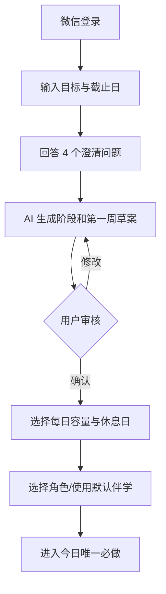
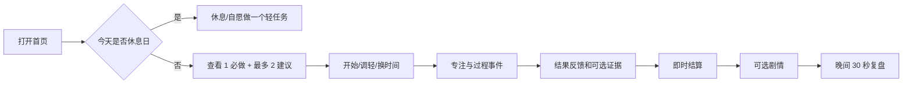
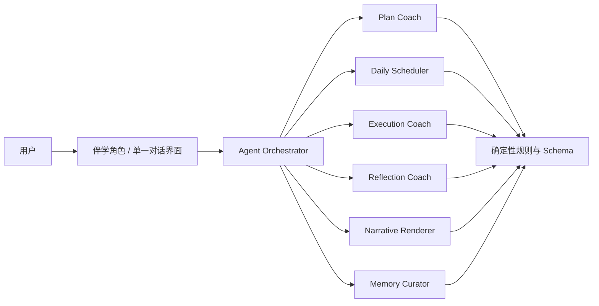
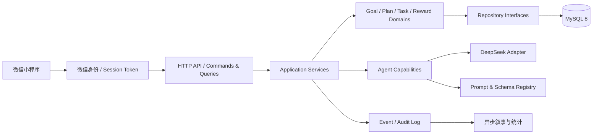

# 织梦学旅 V2 具体改造方案（第一轮审核稿，已归档）

> 版本：0.1  
> 日期：2026-09-02  
> 状态：已被 2026-09-02 的产品审核意见收敛，不再作为当前实施范围  
> 依据：当前仓库源码、`PROJECT_OVERVIEW.md`、开源项目深度调研及行为干预研究结论

> 当前有效方案请阅读 [`CURRENT_REFINEMENT_DESIGN.md`](./CURRENT_REFINEMENT_DESIGN.md)。第一轮方案保留为长期演进参考，其中服务端计时、完整恢复系统、掌握度模型、数据库生产化和大规模页面改组均不进入当前迭代。

## 1. 审核结论摘要

建议将下一版定位为：

> **面向 2—12 周阶段性学习目标的 AI 学习执行伙伴：帮助用户把目标变成经过确认的计划，每天完成一个最重要的学习行动，并在中断后容易重新开始。**

V2 不继续扩充商城、副本、公会或复杂 RPG 数值，而是集中解决五个问题：

1. AI 计划未经用户确认，缺少基础、资料、时间和成功标准等上下文；
2. 每个目标固定释放 3 主线 + 2 支线，多目标时任务量失控；
3. 专注计时只存在于前端，点击完成无法说明实际投入或学习结果；
4. 连续、奖励和剧情强于休息、恢复和计划校准；
5. 全局状态、两套 Goal 模型和 4000 行 `sessionService.js` 无法支撑真实多用户。

本方案的产品结果应从：

```text
AI 生成任务 → 用户打卡 → 发奖励 → 展示剧情
```

改为：

```text
理解目标 → 用户确认计划 → 按全局容量安排今日行动
→ 记录执行过程 → 反馈结果 → 调整后续节奏
→ 即时轻奖励 → 每日/每周叙事总结
```

## 2. 本轮改造范围

### 2.1 必须完成（P0）

- 聚焦阶段性学习目标，一个主目标，可选一个次目标；
- 增加目标澄清、计划草案、用户确认和每周复盘；
- 每日改为全局 **1 个必做 + 最多 2 个建议**；
- 增加计划休息日、5 分钟恢复模式和任务候选池；
- 专注过程服务端留痕，完成时采集实际时长、难度和结果反馈；
- 严格区分“执行完成”和“学习掌握”；
- 合并 `goalPlan` 与 `goalPortfolio`，建立唯一 Goal 聚合；
- 微信身份/会话鉴权、用户数据隔离、数据库事务和幂等；
- 将任务完成、奖励、星图点亮改为同一事务；
- 隐藏商城与夜间副本，删除假初始成长数据和无法证明的掌握度。

### 2.2 应当完成（P1）

- 每日结束复盘和每周节奏调整；
- 用户可查看、纠正和删除 Agent 记忆；
- AI 输出 Schema 校验、超时、有限重试、Prompt 版本和调用审计；
- 首页、专注、完成、日志和目标工作台重构；
- 结构化行为埋点、错误日志和核心漏斗看板；
- 建立 API 契约、鉴权隔离、事务幂等和关键小程序流程测试。

### 2.3 验证后再做（P2）

- 对具有明确回忆结果的知识对象接入 FSRS；
- 恢复简化后的章节副本；
- 长期记忆语义检索或 Mem0；
- 复杂可中断 Agent 工作流或 LangGraph；
- 公会、排行榜、商城、多货币和装备构筑。

## 3. 目标用户和产品边界

### 3.1 首要用户

- 有考试、课程、证书、作品集等明确结果；
- 目标周期 2—12 周；
- 每天可投入 20—120 分钟；
- 不擅长拆解、排序或持续执行；
- 接受轻度角色和收藏反馈，但核心需求仍是完成学习。

### 3.2 V2 暂不服务

- 团队项目协作；
- 健身、财务、戒瘾等高风险行为干预；
- 纯习惯打卡；
- 纯 RPG 或养成游戏；
- 没有期限和成功标准的泛化人生规划。

### 3.3 目标数量规则

- 默认只能启用 1 个主目标；
- 可增加 1 个次目标，但必须设置每周频率和优先级；
- 其他目标进入 `PAUSED` 或 `BACKLOG`，不参与每日自动发布；
- 每日容量属于用户，不属于某个目标，多个目标竞争同一容量。

## 4. 新的核心用户流程

### 4.1 首次使用



固定澄清问题：

1. 你当前处于什么水平，已经完成了什么？
2. 你准备使用哪些教材、课程、题库或项目资料？
3. 哪个可观察结果代表目标完成？
4. 每周哪几天可学习，每天大约有多少分钟？

只有目标类型确实需要时，AI 才能追加最多 2 个动态问题。不能把开放式聊天当成必经流程。

### 4.2 每日执行



每日成功不再等于“清空所有任务”。完成必做任务即达成当日核心进度，建议任务只提供额外推进，不制造欠债。

### 4.3 中断恢复

满足任一条件进入恢复模式：

- 连续两个计划学习日没有启动任务；
- 三天内两次主动放弃；
- 用户主动选择“今天状态不好”；
- 过去三次实际时长均小于预计时长的 50%。

恢复模式规则：

- 不自动搬运全部未完成任务；
- 候选池只保留仍然有效的任务；
- 首页只展示一个 5—10 分钟恢复行动；
- 完成恢复行动给予正常正反馈，不发“补签”或“挽回损失”文案；
- 完成后询问明天保持、恢复正常或继续轻量。

### 4.4 每周复盘

每 7 天或完成 3 个有效学习行动后触发，用户只需回答：

- 哪些任务真的有帮助？
- 实际投入比计划多还是少？
- 下周保持、调轻、加速还是换方向？
- 哪个问题最需要解决？

Agent 给出调整草案，用户确认后才修改后续阶段、频率和容量。

## 5. 页面和交互改造

### 5.1 页面信息架构

底部 Tab 调整为：

| Tab | V2 职责 | 当前页面映射 |
| --- | --- | --- |
| 今天 | 必做、建议、容量、恢复入口 | `pages/home` 重构 |
| 旅程 | 阶段、周计划、星图、目标管理 | 当前星图 + `goal-map` 合并 |
| 记录 | 执行时间线、复盘、学习产物 | `pages/journal` 重构 |
| 我的 | 角色、节奏、记忆、数据与隐私 | `pages/profile` 重构 |

“副本”不进入 Tab；商城不提供入口。

### 5.2 首页“今天”

首屏只保留四层：

1. 今日日期、计划容量和已使用时间；
2. 一张明显的“今日必做”卡片；
3. 最多两张弱化的建议卡片；
4. 伴学的一句话解释和“调整今天”入口。

必做卡片展示：

- 任务动作；
- 预计分钟；
- 对应目标/阶段；
- “为什么今天做”；
- 成功证据类型；
- 开始、5 分钟版本、移动三个操作。

不在任务卡片直接显示复杂成长值、资源、攻击或防御。奖励在完成后显示，避免用户按奖励而不是学习价值选任务。

### 5.3 计划审核页（新增）

路径建议：`features/goal/plan-review/index`

展示内容：

- 目标、截止日、成功证据；
- 阶段列表及每阶段输出；
- 第一周每日节奏和总分钟；
- AI 的三条关键假设；
- 风险提示，例如时间不足或资料不明确。

支持操作：

- 修改阶段；
- 修改任务或时长；
- 设置休息日；
- 选择调轻/正常/加速；
- 确认发布；
- 重新生成，但最多连续 3 次，之后建议人工编辑。

### 5.4 专注页

当前纯前端倒计时改为服务端执行会话：

- 开始时创建 `execution_session`；
- 暂停、恢复、休息和放弃写入事件；
- 页面隐藏或小程序被系统回收后，按服务端时间恢复；
- 支持 Flowtime，不强制倒计时结束才可完成；
- 支持一键切换为 5 分钟版本；
- 网络中断时本地排队，恢复后按 `eventId` 幂等上传。

### 5.5 完成页

顺序改为：

1. 立即显示“已记录”，不等待 AI；
2. 询问实际感受：困难 / 合适 / 轻松；
3. 询问结果：未完成 / 最低版本 / 完成；
4. 根据任务类型采集一个轻量结果；
5. 后端确定性结算；
6. 剧情卡片异步出现，可展开或稍后阅读。

轻量结果可选项：

- 写一句总结；
- 记录一个问题；
- 上传图片/文件；
- 完成一道回忆题；
- 仅自我报告。

只有“回忆题结果”可以更新知识记忆状态；总结、图片和自评只能证明执行或提供复盘上下文，不能直接显示为掌握度。

### 5.6 旅程页

- 默认展示当前阶段、这周里程碑和星图；
- 星图一颗星代表一个被用户确认的主行动，不再预先生成整个目标期的所有星位；
- 计划变更时历史星星不消失，未来节点按新计划生成；
- 星图完成奖励继续保留功能性道具；
- 目标切换、暂停和周频率在同一页面管理。

### 5.7 记录页

参考 Memos 的低摩擦时间线：

- 默认按日期显示任务、实际时长、反馈、产物和反思；
- 用户可在 30 秒内补充一句话；
- 剧情和真实学习记录视觉分层；
- 支持按目标、任务类型和“待复习”过滤；
- 不把所有 Agent 内部记忆混进用户日记。

### 5.8 我的

- 角色和叙事强度：关闭 / 轻量 / 完整；
- 每日容量、休息日、主次目标；
- 节奏分及计算说明；
- Agent 记忆查看、纠正、删除；
- 数据导出、注销和隐私说明；
- 调试环境才显示模型和运行信息。

## 6. 每日调度与恢复算法

### 6.1 全局容量

设用户当天容量为 `C` 分钟：

- 预留 10% 缓冲，自动计划上限为 `0.9C`；
- 必做任务最多占 `0.6C`，且原则上不超过 45 分钟；
- 复习任务最多占 `0.25C`；
- 剩余容量才安排建议任务；
- 任何自动任务最小为 5 分钟、最大为 45 分钟，较大任务必须拆分。

### 6.2 目标选择

候选目标使用可解释规则排序：

```text
目标得分 = 截止紧迫度 × 35%
         + 用户优先级 × 30%
         + 距离上次推进时间 × 20%
         + 前置任务就绪度 × 15%
```

硬规则优先于分数：休息日不自动发布；暂停目标不参与；超过每周频率的次目标不参与；存在强前置关系时不跳步。

### 6.3 任务选择顺序

1. 到期且必要的复习/检查；
2. 主目标中最接近本周里程碑的一个可执行动作，作为必做；
3. 次目标或主目标补充动作，作为建议；
4. 只有仍有容量时才加入整理或反思。

每个结果保存 `selectionReason`，前端只展示一句用户能理解的解释，例如“周五有模拟测试，今天先完成错题分类”。

### 6.4 未完成任务处理

- 未完成任务进入候选池，不默认复制到第二天；
- 次日重新判断是否仍重要、是否需要拆小或取消；
- 同一任务连续两次未完成，必须触发调轻或用户确认；
- 过期且无价值的任务标记 `EXPIRED`，不保留成永久债务；
- 用户主动跳过时采集原因：没时间、太难、不相关、环境不允许、已经完成其他方式。

### 6.5 节奏分

用 Loop 式平滑思想替代“断一天归零”。V2 可先使用透明的 14 个计划日加权分：

```text
rhythm = 100 × Σ(0.9^距今天数 × 当日结果) / Σ(0.9^距今天数)
```

当日结果：

- 完成必做：1.0；
- 完成最低版本：0.6；
- 已开始并留下记录：0.3；
- 未开始：0；
- 计划休息日：不进入分母。

该分数只表达近期执行节奏，不命名为“自律值”或“掌握度”，也不直接扣除既有奖励。

## 7. 学习证据和复习机制

### 7.1 两套指标必须分开

**执行指标：** 是否开始、实际分钟、是否完成、是否调轻、是否中断。  
**学习指标：** 只有存在回忆、测验、订正或明确作品评审时才生成。

### 7.2 任务证据策略

每个任务模板保存 `evidencePolicy`：

| 类型 | 示例 | 对掌握度的影响 |
| --- | --- | --- |
| `SELF_REPORT` | 用户确认做完 | 无 |
| `REFLECTION` | 一句总结或问题 | 无，供规划使用 |
| `ARTIFACT` | 笔记、图片、文件 | 仅证明产出存在 |
| `RECALL` | 回忆题或自测结果 | 可以更新记忆状态 |

V2 首发只要求必做任务提交结果反馈；总结和产物默认可选。对于明确的验证类任务，允许要求 `RECALL` 或 `ARTIFACT`。

### 7.3 复习调度

第一阶段继续采用简单、可解释的反馈规则：

- 困难或回忆失败：次日；
- 合适：3 天后；
- 轻松且回忆成功：7 天后；
- 连续两次成功：延长到 14 天。

只有积累足够的真实回忆记录后，再评估 FSRS。禁止将普通任务完成记录伪装成 FSRS 数据。

## 8. 奖励与叙事改造

### 8.1 奖励规则

后端继续作为唯一裁决者，奖励采用固定、可审计规则：

| 行为 | 建议成长值 | 说明 |
| --- | ---: | --- |
| 完成今日必做 | 20 | 不按用户填写的难度放大 |
| 完成建议任务 | 10 | 建议任务不影响当日成功 |
| 完成最低版本 | 12 | 鼓励恢复，不视为失败 |
| 提交反思或结果 | +5 | 每任务最多一次 |
| 完成有效回忆 | +5 | 必须有回忆结果 |
| 完成周复盘 | 15 | 每周最多一次 |

预计时长不直接决定奖励，防止通过放大分钟数套利。重复请求由奖励账本唯一约束防止重复发放。

### 8.2 星图

- 一颗主星对应一个“经过用户确认并完成的必做行动”；
- 最低版本可以点亮较弱样式的星，不阻断图鉴；
- 星图继续奖励专注、拆解、复习、复盘类工具；
- “5 分钟保底”变为基础功能，守护类道具改为允许额外调整或保护一周节奏。

### 8.3 叙事频率

- 每个任务完成不再阻塞调用模型；
- 日常默认只展示一句角色反馈；
- 每日首次有效完成后可生成一张短剧情卡；
- 每周复盘后生成完整章节；
- 用户可选择关闭、轻量或完整；
- 记录剧情展开率和跳过率，连续多次跳过则自动降低频率。

## 9. Agent 方案

### 9.1 总体原则

用户仍只看到一个角色伴学，不制造六个角色轮流说话。后台把能力拆开，是为了明确责任、输入输出和失败处理，不是建设多个自主 Agent。



### 9.2 能力与边界

| 能力 | 是否调用 LLM | 输入 | 输出 | 无权处理 |
| --- | --- | --- | --- | --- |
| Plan Coach | 是 | 目标、澄清答案、容量 | 阶段和首周草案 | 自动发布、奖励 |
| Daily Scheduler | 默认否 | 容量、目标优先级、候选任务 | 1 必做 + 最多 2 建议 | 新造长期目标 |
| Execution Coach | 否/模板 | 当前任务、执行事件 | 拆小、恢复、下一动作 | 判定掌握 |
| Reflection Coach | 是 | 结构化周数据、用户反馈 | 节奏调整草案 | 未确认即改计划 |
| Narrative Renderer | 是，可异步降级 | 已结算事件、角色、有限记忆 | 用户可见剧情 | 改业务状态 |
| Memory Curator | 规则优先 | 用户明确反馈、重要事件 | 可审查结构化记忆 | 隐式保存敏感推断 |

### 9.3 人工确认点

以下操作必须由用户确认：

- 发布首次计划；
- 改变截止日、每周频率或每日容量；
- 删除/暂停目标；
- 周复盘后的批量重规划；
- 将 Agent 推断写为长期偏好；
- 将临时记忆升级为长期记忆。

任务文案微调、每日候选排序和过期任务清理可以按已确认规则自动完成，但必须可撤销。

### 9.4 Agent 状态机

```text
GOAL_DRAFT
  → CLARIFYING
  → PLAN_DRAFT
  → USER_REVIEW
  → ACTIVE
  → WEEK_REVIEW_DUE
  → REPLAN_DRAFT
  → USER_REVIEW
  → ACTIVE

ACTIVE → PAUSED → ACTIVE
ACTIVE → COMPLETED → ARCHIVED
```

每个转换保存 `commandId/userId/goalId/from/to/reason/actor/createdAt`，便于恢复和审计。

### 9.5 记忆模型

保留 L1/L2/L3 思想，但由“剧情摘要”升级为可治理记忆：

```text
Memory {
  id, userId, goalId,
  category: PREFERENCE | CONSTRAINT | STRATEGY | REFLECTION | STORY,
  content,
  sourceType, sourceId,
  confidence,
  validUntil,
  userConfirmed,
  createdAt, updatedAt
}
```

- L1：最近 7 天、当前目标直接相关；
- L2：每周复盘和阶段摘要；
- L3：用户确认的长期偏好、永久称号和重要成就；
- 用户可以查看、纠正、删除；
- 首版按用户、目标、类型、时间检索，不急于接向量库；
- 剧情世界实体与真实用户偏好分库存放，避免虚构内容污染规划。

### 9.6 AI 可靠性预算

- 首次目标：1 次计划生成，必要时 1 次修订；
- 日常调度：零 LLM；
- 完成任务：结算零 LLM，短剧情允许异步一次；
- 周复盘：最多一次分析、一次用户要求的修订；
- 单次超时建议 8 秒；
- 429/5xx 最多重试 2 次，采用退避；
- 所有结构化输出使用 JSON Schema/Ajv；
- 保存 `promptVersion/model/latency/tokenUsage/fallbackReason`；
- AI 失败必须退化为规则计划或模板文本，不影响任务状态。

首版不引入 LangGraph。当前流程节点固定，使用显式状态机、数据库检查点和命令日志更容易测试。

## 10. 目标技术架构



建议沿用已有 MySQL 方向，减少技术切换；静态角色/技能配置继续使用 Front-matter + Markdown。

### 10.1 领域模型

| 实体 | 关键职责 |
| --- | --- |
| `User` | 微信身份、时区、偏好、叙事强度 |
| `Goal` | 目标、期限、优先级、频率、容量、状态、成功标准 |
| `Phase` | 阶段顺序、输出、起止范围 |
| `TaskTemplate` | 计划中的可执行动作及证据策略 |
| `DailyPlan` | 某用户某日的容量和发布结果 |
| `TaskInstance` | 某天真正执行的任务实例 |
| `ExecutionSession` | 实际开始、暂停、恢复、结束时间 |
| `CompletionFeedback` | 结果、难度、自评和证据 |
| `ReviewItem` | 可回忆知识对象和下次日期 |
| `RewardLedger` | 不可重复的奖励流水 |
| `Memory` | 可治理的结构化 Agent 记忆 |
| `NarrativeEntry` | 与真实学习记录分离的剧情内容 |
| `LlmRun` | 模型调用、Prompt 版本、耗时和降级原因 |

### 10.2 任务状态

```text
DRAFT → CANDIDATE → PLANNED → IN_PROGRESS
                         ├→ COMPLETED
                         ├→ MINIMUM_COMPLETED
                         ├→ SKIPPED
                         ├→ ABANDONED
                         └→ EXPIRED
```

`TaskTemplate` 与 `TaskInstance` 分离，防止计划调整覆盖历史执行记录。

### 10.3 数据表调整

现有 `mysql-schema.sql` 只能覆盖比赛版故事模型，需要新增或重构：

- `auth_sessions`
- `user_preferences`
- `goal_contexts`
- `goal_phases`
- `task_templates`
- `daily_plans`
- `task_instances`
- `execution_sessions`
- `execution_events`
- `completion_feedback`
- `evidence_items`
- `review_items`
- `reward_ledger`
- `agent_memories`
- `narrative_entries`
- `llm_runs`
- `command_log`

所有业务表必须包含 `user_id`；所有 Repository 方法显式传入 `userId`。任务完成、奖励流水和星图推进在一个事务中提交。

### 10.4 应用服务拆分

现有 `sessionService.js` 在迁移期保留为兼容门面，内部逐步委托给：

- `AccountApplicationService`
- `GoalApplicationService`
- `PlanReviewApplicationService`
- `DailyPlanningApplicationService`
- `ExecutionApplicationService`
- `TaskCompletionApplicationService`
- `ReviewApplicationService`
- `RewardApplicationService`
- `StarMapApplicationService`
- `AgentApplicationService`
- `NarrativeApplicationService`
- `LegacyMigrationService`

查询与命令分开；`GET /api/sessions/current` 不再执行跨日迁移或写文件。跨日发布使用显式命令或首次读取时由服务端安全地执行幂等 `ensureDailyPlan(userId, date)`。

## 11. V2 API 草案

所有写接口接收 `Idempotency-Key`，所有业务接口从服务端认证上下文读取 `userId`。

| 方法 | 路径 | 用途 |
| --- | --- | --- |
| `POST` | `/api/v2/auth/wechat-login` | 微信登录与会话签发 |
| `POST` | `/api/v2/goals/drafts` | 创建目标草稿 |
| `POST` | `/api/v2/goals/{id}/clarifications` | 提交澄清答案 |
| `POST` | `/api/v2/goals/{id}/plan-drafts` | 生成计划草案 |
| `PATCH` | `/api/v2/goals/{id}/plan-drafts/{draftId}` | 用户编辑草案 |
| `POST` | `/api/v2/goals/{id}/plan-confirmations` | 确认并发布计划 |
| `GET` | `/api/v2/today` | 只读获取今日计划和容量 |
| `POST` | `/api/v2/daily-plans/ensure` | 幂等生成/确认某日计划 |
| `POST` | `/api/v2/tasks/{id}/execution-sessions` | 开始执行 |
| `POST` | `/api/v2/execution-sessions/{id}/events` | 暂停、恢复、休息、结束 |
| `POST` | `/api/v2/tasks/{id}/completions` | 提交结果、反馈和证据 |
| `POST` | `/api/v2/tasks/{id}/adjustments` | 调轻、拆小、改期、放弃 |
| `POST` | `/api/v2/recovery-plans` | 生成一个恢复行动 |
| `GET` | `/api/v2/journey` | 阶段、里程碑和星图 |
| `POST` | `/api/v2/weekly-reviews` | 提交周复盘并生成调整草案 |
| `POST` | `/api/v2/weekly-reviews/{id}/confirmations` | 确认周调整 |
| `GET/PATCH/DELETE` | `/api/v2/memories/{id}` | 查看、纠正、删除记忆 |
| `GET` | `/api/v2/activity` | 执行与复盘时间线 |

响应不再每次返回完整 AppState。命令返回 `event + changedResources`，查询按页面返回专用 DTO，降低状态耦合和传输量。

## 12. 代码目录改造建议

### 12.1 后端

```text
backend/src/
  domain/
    goal/
    planning/
    execution/
    review/
    reward/
    agent-memory/
  application/
    commands/
    queries/
    services/
  infrastructure/
    database/
    repositories/
    llm/
    auth/
    telemetry/
  interfaces/http/
    routes/
    contracts/
    middleware/
```

现有 `services/*` 不一次性搬迁。每完成一个垂直闭环，就把对应逻辑从 `sessionService` 移出并用测试锁定行为。

### 12.2 小程序

```text
miniprogram/
  pages/
    today/
    journey/
    activity/
    profile/
  features/
    goal/setup/
    goal/clarification/
    goal/plan-review/
    execution/focus/
    execution/completion/
    review/daily/
    review/weekly/
    memory/manage/
  components/
    task-card/
    capacity-bar/
    evidence-picker/
    story-card/
    empty-state/
```

`services/api.js` 增加认证头、幂等键、网络重试和 V2 DTO；页面不再依赖完整状态对象在 `globalData` 中传递，跨页只传 ID，进入页面后按专用接口加载。

## 13. 迁移方案

### 13.1 原则

- 不同时长期维护 `goalPlan` 和 `goalPortfolio`；
- 不在生产中长期双写 JSON 与数据库；
- 迁移前保留只读快照和校验报告；
- V1 API 在过渡期只服务旧客户端，V2 客户端不读取旧模型。

### 13.2 数据映射

| 当前字段 | V2 |
| --- | --- |
| `goalPortfolio.goals[]` | `goals` 主数据 |
| `goalPlan.stageGoals[]` | 仅用于补齐缺失 `phases`，随后停止写入 |
| `goal.nodes[]` | `task_templates`，历史完成节点转换为 `task_instances` |
| `dailyPlan` / history | `daily_plans` |
| `tasks` / history | `task_instances` |
| `memories` / memoryTree | `agent_memories` + archive |
| `diary` | `activity_entries` / `narrative_entries` 分流 |
| `stats` / starMap | `reward_ledger` 汇总 + constellation records |

### 13.3 上线步骤

1. 为现有 JSON Store 编写只读迁移器和校验器；
2. 建立数据库 Schema、Repository 和测试；
3. 迁移测试账号，比较目标数、任务数、奖励余额和星图数量；
4. 开启 `PRODUCT_LOOP_V2` 内部测试；
5. 冻结旧写入，生成最终快照，执行一次性迁移；
6. 通过校验后切换 V2；
7. 旧数据至少保留 30 天只读备份；
8. 若校验失败，回滚客户端开关和数据库版本，不覆盖原快照。

## 14. 实施阶段与工作量

以下按 1 名后端、1 名小程序开发、产品/设计/测试共享投入估算。

### M0：决策冻结与原型（3 个工作日）

- 审核本方案中的 10 项决策；
- 低保真确认首页、计划审核、完成反馈和周复盘；
- 固定 V2 事件字典、DTO 和核心指标；
- 建立功能开关和数据库迁移分支。

交付：交互稿、API 草案、事件表、最终技术拆分。

### M1：核心产品垂直切片（8 个工作日）

- 澄清问题和计划审核；
- 全局 1 必做 + 2 建议调度；
- 首页与恢复模式；
- 专注事件和完成反馈；
- 确定性奖励与异步剧情；
- 使用测试 Repository 验证完整闭环。

交付：可供内部单用户验证的 V2，不对外开放多用户。

### M2：生产工程基础（12 个工作日）

- 微信身份、会话令牌、用户隔离；
- MySQL Schema 与 Repository；
- 合并 Goal 模型；
- 任务/奖励/星图事务及幂等；
- 拆出核心 Application Service；
- API 契约、跨用户隔离、重启恢复和并发测试。

交付：可支持小规模真实用户的后端。

### M3：复盘、记忆和 AI 治理（8 个工作日）

- 每日/每周复盘；
- 简化复习调度；
- 记忆查看、纠正和删除；
- Schema、超时、重试、Prompt 版本、调用日志；
- 记录页和旅程页改造。

交付：完整 7 日学习闭环。

### M4：试用与加固（5 个工作日 + 14 天观察）

- 5 名内部用户完成 7 天走查；
- 修复阻断问题后邀请 10—15 名目标用户试用 14 天；
- 监控漏斗、恢复率、AI 降级和任务超量；
- 根据数据决定是否进入视觉精修和 P2。

总计约 36 个研发工作日的关键路径，约 50—60 人日。上述配置下预计 7—8 个自然周；单人全栈实施预计 12—14 周。

## 15. 验收标准

### 15.1 产品验收

- 用户可在 3 分钟内完成目标输入、澄清并看到计划草案；
- 计划未经确认不会发布任务或点亮星图；
- 任意一天自动发布不超过 1 必做 + 2 建议；
- 自动计划总时长不超过用户容量的 90%；
- 计划休息日不会降低节奏分；
- 连续两个计划日未启动后，系统只给一个恢复任务；
- 完成结算不等待 LLM，模型失败不影响奖励；
- 页面不在无测验证据时显示掌握度；
- 用户可以查看并删除 Agent 长期记忆；
- 副本与商城不出现在核心导航和新手流程。

### 15.2 工程验收

- 两个并发用户不能读取或修改对方数据；
- 容器重启后目标、执行会话和奖励不丢失；
- 相同 `Idempotency-Key` 重试完成接口不会重复奖励或点星；
- 任务完成、奖励账本和星图推进要么全部成功，要么全部回滚；
- `GET` 查询不产生业务状态写入；
- 所有 LLM 结构化输出经过 Schema 校验；
- LLM 超时、429、5xx 和无 Key 均有明确降级测试；
- 关键请求日志包含 `requestId/userId/commandId/goalId/taskId/llmRunId`；
- 数据迁移前后目标、完成任务、奖励余额和星图数量校验一致；
- CI 执行语法/Lint、领域测试、API 契约、数据库迁移、小程序校验和 Docker 健康检查。

### 15.3 性能目标

- 非 AI 查询 P95 < 500ms；
- 非 AI 写命令 P95 < 800ms；
- 完成操作在 1 秒内反馈“已记录”；
- AI 结果异步返回，8 秒超时后使用降级内容；
- 单个用户当日计划生成保持幂等，重复调用不重复创建任务。

## 16. 指标与验证

### 16.1 北极星指标

> **每周完成至少 3 次“用户确认过且留下结果反馈的有效学习行动”的活跃用户比例。**

“有效学习行动”至少满足：任务已确认、存在执行记录、提交完成结果；不要求一定上传产物。

### 16.2 漏斗指标

- 目标输入完成率；
- 澄清完成率；
- 计划确认率与平均修改次数；
- 确认后 24 小时内首项启动率；
- 必做完成率和最低版本完成率；
- 实际/预计时间偏差；
- 反馈提交率和证据提交率；
- 周复盘完成率；
- 7 日有效行动留存。

### 16.3 恢复指标

- 触发恢复模式的人数；
- 恢复任务启动率；
- 恢复任务完成率；
- 中断后 72 小时内重新完成有效行动的比例；
- 未完成任务被自动搬运的平均次数，目标应接近 0。

### 16.4 护栏指标

- 自动计划超容量率 < 2%；
- 同一任务连续两次未完成但未触发调整率 = 0；
- AI 计划 Schema 失败率；
- LLM 降级率、P95 延迟和单活跃用户成本；
- 剧情跳过率；
- 跨用户访问测试失败数 = 0；
- 重复奖励数 = 0。

小样本试用阶段的数值只用于发现问题，不宣称因果效果，也不进行没有统计能力的 A/B 测试。

## 17. 主要风险与应对

| 风险 | 影响 | 应对 |
| --- | --- | --- |
| 收敛任务后首次体验不够“热闹” | 演示吸引力下降 | 保留角色选择、星图和首章短剧情，但不阻塞核心操作 |
| 目标澄清增加首次步骤 | 用户流失 | 固定 4 问、提供选项和跳过，3 分钟内到达草案 |
| 合并 Goal 模型导致历史数据错位 | 进度损坏 | 只读快照、迁移校验、灰度账号、可回滚开关 |
| 服务端计时遇到弱网 | 记录丢失 | 客户端事件队列 + `eventId` 幂等 + 服务端时间校正 |
| 证据要求太重 | 完成率下降 | 首发只强制结果反馈，产物默认可选 |
| AI 计划不稳定 | 信任下降 | Schema、规则门禁、容量校验、用户确认和模板降级 |
| 叙事与真实记录混杂 | 用户误解 | 分离 Activity 与 Narrative，视觉和数据表均分层 |
| 同时做产品和架构导致周期过长 | 交付延迟 | 先做垂直切片验证交互，再完成生产数据库与隔离；禁止对外使用临时单用户版 |

## 18. 审核决策清单

请逐项批准、修改或否决：

| 编号 | 待审核事项 | 推荐决定 | 可选方案及影响 |
| --- | --- | --- | --- |
| D1 | 产品范围 | 聚焦 2—12 周阶段性学习目标 | 保持通用自律平台会增加规划标准和验证方式的复杂度 |
| D2 | 活动目标数 | 1 个主目标 + 1 个次目标 | 完全单目标更简单；无限多目标会重新造成任务爆炸 |
| D3 | 每日任务量 | 1 必做 + 最多 2 建议 | 2 必做适合高投入用户，但首版认知和失败压力更高 |
| D4 | 用户控制权 | 首次计划和周重规划必须确认 | 自动发布更快，但会降低可信度并放大错误计划 |
| D5 | 恢复规则 | 休息不计失败；连续中断后只给 5—10 分钟行动 | 保留 streak 归零更有刺激性，但不符合本版恢复优先原则 |
| D6 | 学习证据 | 分开执行与掌握；首发强制结果反馈，产物可选 | 强制上传产物更可靠，但会明显增加完成阻力 |
| D7 | 玩法范围 | 隐藏商城和夜间副本 | 保留会增加入口和模型复杂度，核心闭环验证更困难 |
| D8 | Agent 形态 | 一个用户角色 + 六种后台受控能力，不引入多 Agent 框架 | 多角色 Agent 更具展示性，但协调、可解释和测试成本更高 |
| D9 | 生产基础 | MySQL 8 + 微信身份 + Repository + 事务幂等 | 继续 JSON 只适合单用户演示，不能开放真实多用户 |
| D10 | 交付计划 | 双开发约 7—8 周，P2 单独立项 | 压缩到 4 周必须减少数据库迁移、记忆治理或周复盘中的至少一项 |

建议审核回复格式：`D1 通过；D2 改为仅一个目标；D3 通过……`。未明确反对的事项不应自动视为批准，全部决策确认后再进入 M0。

## 19. 审核通过后的第一批任务

审核通过后，不立即大规模编码，先完成以下可验证产物：

1. 首页、计划审核、完成反馈、周复盘四张低保真流程图；
2. `Goal / Phase / TaskTemplate / TaskInstance / ExecutionSession` 数据字典；
3. V2 API OpenAPI 草案和错误码；
4. 每日调度器的 25 个固定测试用例；
5. JSON Store 到 V2 模型的迁移样例和校验报告；
6. 5 个典型学习目标的计划评测集；
7. M1 垂直切片的任务拆解与负责人。

在这七项通过评审后，再进入正式实现。
